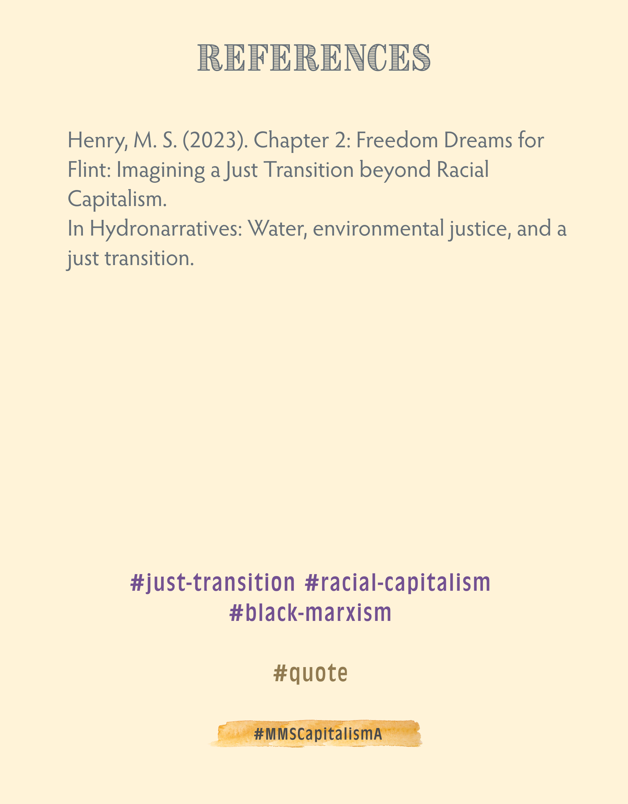

# Difference and division are core-components of capitalist thriving 

**LINKS:**
Henry, M. S. (2023). Chapter 2: Freedom Dreams for Flint: Imagining a Just Transition beyond Racial Capitalism. In [Hydronarratives: Water, environmental justice, and a just transition](https://1drv.ms/b/s!AmcwErz2Mmg1hcMer7RCCABah8BPPw?e=UkMFKN).

## Introduction to capitalism 
"Capitalism is an economic system in which  employers, using privately owned capital, hire wage labor to produce commodities for the purpose of making a profit" (Andersson & Eriksson 2010, p.125). Capitalist businesses often rely on the governing structures of **workplace dictatorship**, in which the owner of the company or business has the right to tell the worker what to do (Wright 2019). This structure in itself creates a power divide and social division. These power structures pertrude throughout the globalized economy.

More in-depth info you can find in the section [[OVERVIEW-CAPITALISM]].

________
#quote #capitalism #oppression #just-transition #racial-capitalism 
#black-marxism
________
REFERENCES

Andersson, J. O., & Eriksson, R. (2010). Chapter 9 “Growth and Degrowth - Is Another Economy Possible? In Elements of Ecological Economics (1st ed., p. 176). Taylor & Francis.

Henry, M. S. (2023). Chapter 2: Freedom Dreams for Flint: Imagining a Just Transition beyond Racial Capitalism. In Hydronarratives: Water, environmental justice, and a just transition.

Wright, E. O. (2019). How to Be an Anticapitalist in the Twenty-First Century (p. 176). Verso.

