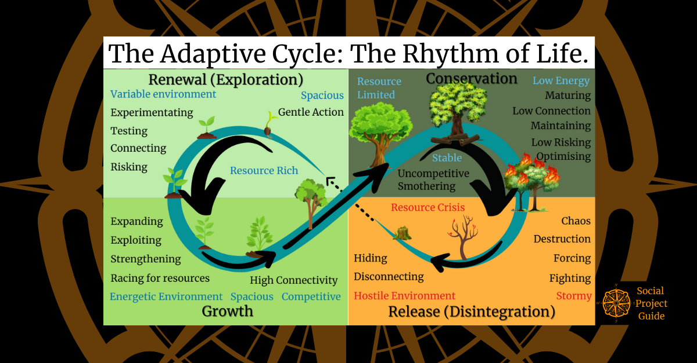

# adaptive cycles help us to understand how to transform our systems

[1]

[2]

Holling's ideas need to be added here

The IPCC AR6 report has a good summary on adaptive cycle literature in relationship to climate change adaptation (p.174)

"In the transformational adaptation literature, Park
et al. (2012) consider incremental and transformational adaptation
as two concentric and linked action-learning cycles with similar steps
that include monitoring and learning." (p.174)

--> here, spiritual self-transformation on a personal level might be crucial to induce action and value-emergence conducive to larger concentric 'action-learning cycles' - see my notes on self-transformation for EJ [[SPIRIT-TRANSFORMATION]] and working with ourselves [[SPIRIT-WORK-A]]

#transformation #adaptation #resiliency #adaptive-cycles
____________
Sources

[1] https://verdisgroup.com/leading-through-disruption-lessons-from-living-systems/

[2] https://projectguide.org/the-adaptive-cycle-lead-social-impact-projects/

Holling, C. S. (2001). Understanding the Complexity of Economic, Ecological, and Social Systems. Ecosystems, 4(5), 390–405. https://doi.org/10.1007/s10021-001-0101-5

IPCC https://report.ipcc.ch/ar6/wg2/IPCC_AR6_WGII_FullReport.pdf

