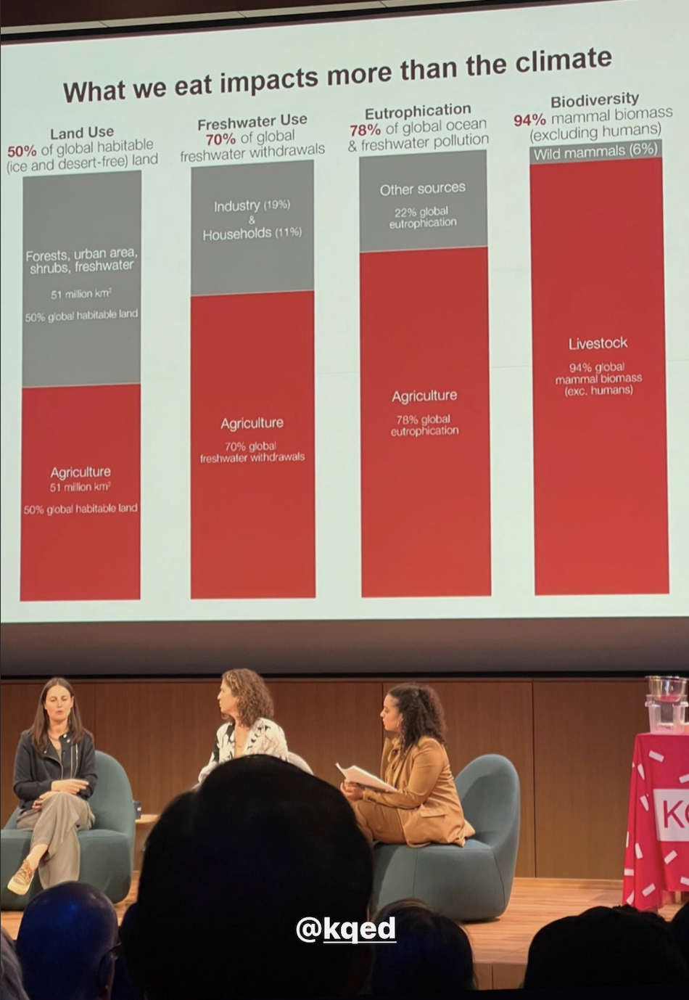

# Summary of emissions of agriculture and livestock

Agriculture contributes about 25% of  all greenhouse gas (GHG) emissions, and about 80% of  that comes from products of  animal agriculture such as meat, milk, and eggs. The agriculture industry has major impacts on the environment, as live-stock production accounts for 70% of  all agricultural land and 30% of  the land surface [...] Another 25% of  greenhouse gases are from electricity and heat. (Mulvaney 2020, p. 218 f.).

Excluding the biomass of humans, 94% of mammal biomass on this planet is livestock. 

See [SEEDS-A](SEEDS-A.md) for info on low crop diversity in agriculture and [MMSMeatStickA](MMSMeatStickA.md) for an in-the-works sticker through which I try to find the right words facing ethical neglect of animal rights. 

_______

#agriculture #livestock

__________

REFERENCES

Mulvaney, D. (2020). Sustainable Energy Transitions: Socio-Ecological Dimensions of Decarbonization (1st ed. 2020, p. 258). Palgrave Macmillan.