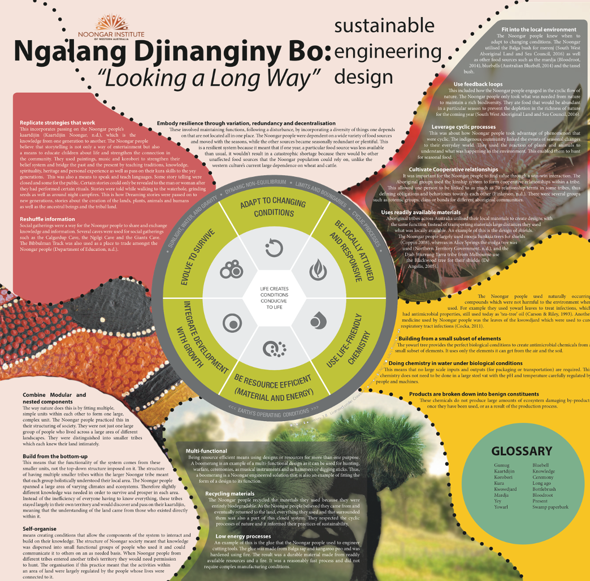

# Biomimicry lessons mapped against the wisdom of the Nonngar people of Western Australia

"Indigenous people were able to live much more in harmony with nature and adopted many principles of circularity in their lives. This diagram by Isabella Georgiou maps the Biomimicry Institute lessons from nature against the wisdom of the Nonngar people of Western Australia." - from the MESH program, Getting to Zero Waste

