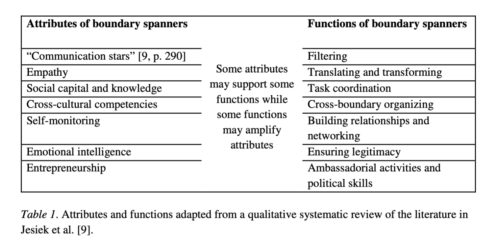

________

Goodrich, K. A., Sjostrom, K. D., Vaughan, C., Nichols, L., Bednarek, A., & Lemos, M. C. (2020). Who are boundary spanners and how can we support them in making knowledge more actionable in sustainability fields? _Current Opinion in Environmental Sustainability_, _42_, 45–51. https://doi.org/10.1016/j.cosust.2020.01.001

