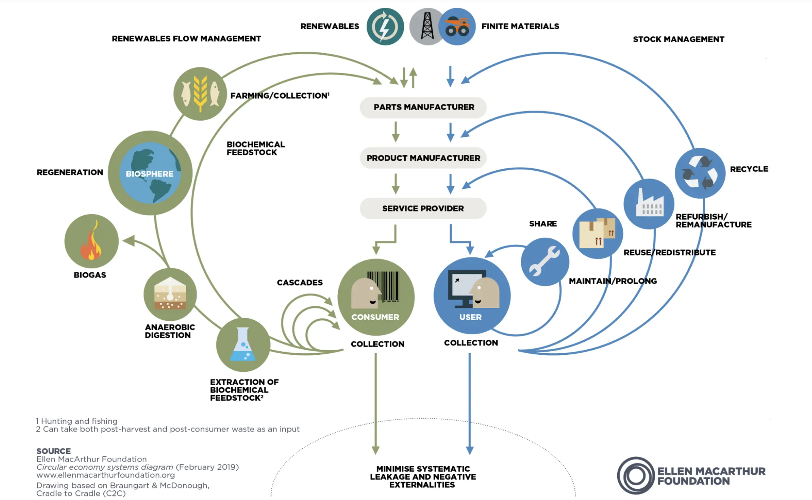

# Overview: Circular economy

https://www.ellenmacarthurfoundation.org/circular-economy-diagram

[This video interview](https://www.youtube.com/watch?v=NBEvJwTxs4w&t=21s) goes over all aspects of the graphic above. Very informative and quickly explained.

**Product design**
The expert panelists from the Tact‘s 2024 San Francisco Design Week event shared their best resources to help others in the product design industry adopt sustainable practices and engage in a circular economy.
https://designbayarea.org/product-design-for-a-circular-economy/

