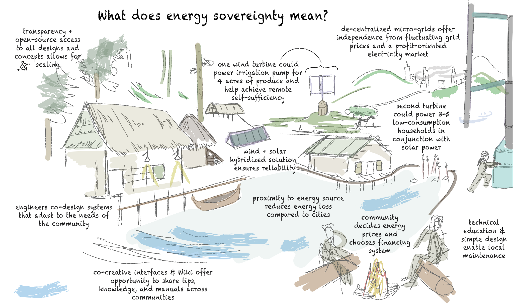
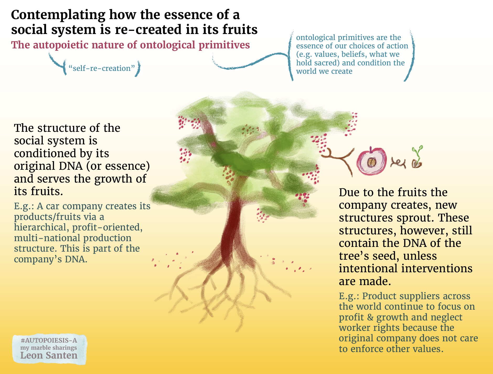
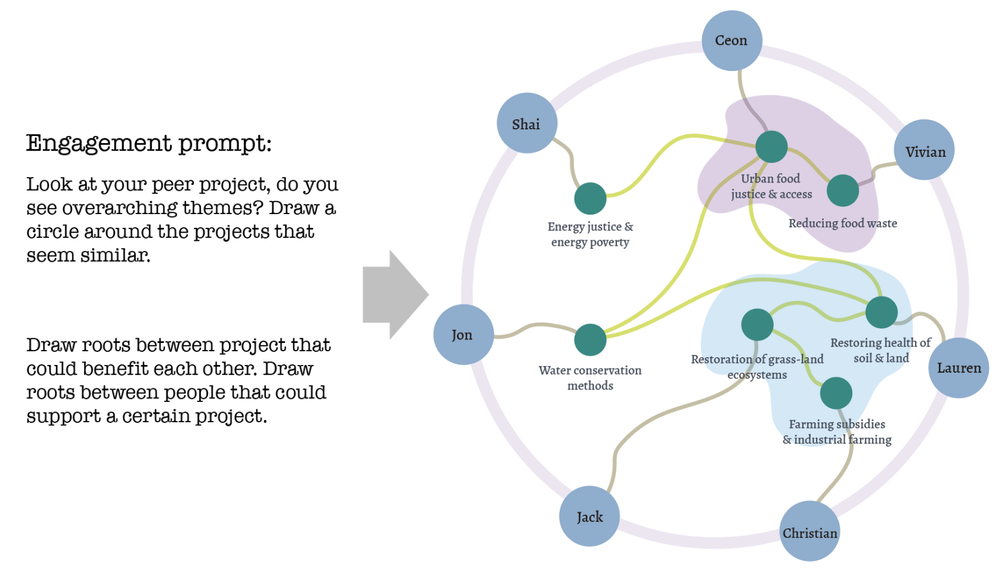

# A loosely structured collection of my visual works in the engineering realm
## For environmental & social justice...

### My attempt to visualize supply chains and the externalities of the engineering economy
More thoughts related to this graphic are here in my marble on [roots of renewables](ROOTS-OF-RENEWABLES.md).

### Visuals for social interventions 
**December 2022** - more thoughts here in the marble [MMSHealthAutopoiesis](MMSHealthAutopoiesis.md).

### Just Energy Hub Work
October 2022, during my Master's in Engineering, Sustainability, and Health.

### Simple graphics for precise messaging 
**January 2025** - This is my work for Redwood Energy, trying to influence CA law to allow car batteries as house batteries. 

### Contemplating very heady things visually
More thoughts at [ONTOLOGICAL-PRIMITIVES](ONTOLOGICAL-PRIMITIVES.md).

### Systemic reasoning and collaborative interface things
more about these topics [over here](MMSSystemicCooperationInterface-A.md).

### Thanks for scrolling :-)

