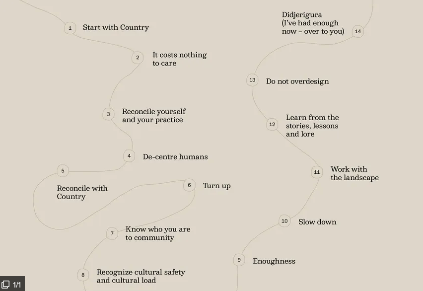

# Designing with country
## A design methodology to rebuild relationships between the land and people

![Text reading: When First Nations speak of Country, it is about the place of their ancestors, stories, lore and knowledge. These memories and connections form the basis of songlines and bind people to their Country. Country is a matter of sustenance and is therefore as much a cultural and spiritual condition as it is a scientific or physical one. Acknowledging that a site belongs to a specific Country on a particular part of this continent enables us to draw inspiration, ideas and opportunities directly from that place and the people who belong to it. Our Designing with Country work guides the way we think about projects that engage with First Nations communities and contexts.](media/cleanshot_2024-10-22-at-21-32-20@2x.png)

More info is on this [original website](https://www.bvn.com.au/tenet/designing-with-country).
# Danièle Hromek’s 14 principles for what non-Indigenous architects can do to Indigenize practice

_________
### References
[1] - https://www.bvn.com.au/tenet/designing-with-country

[2] - https://architectureau.com/articles/designing-with-country-what-can-non-indigenous-designers-do/

%% #from-michelle-feng %%

