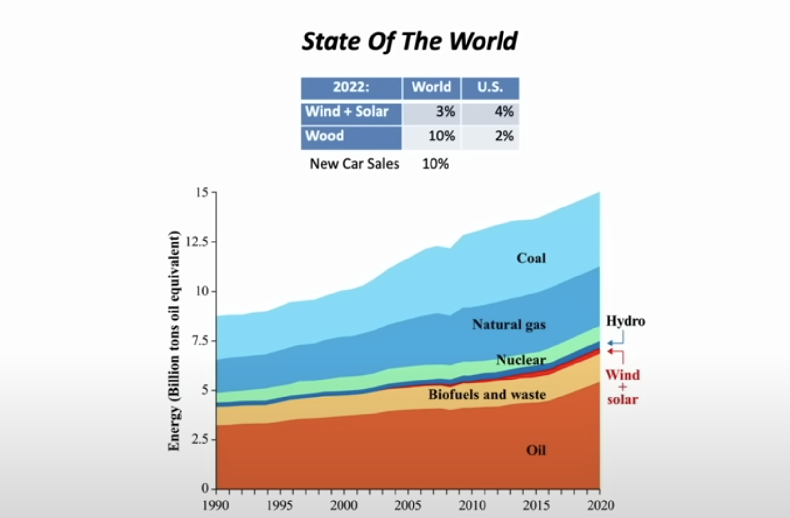
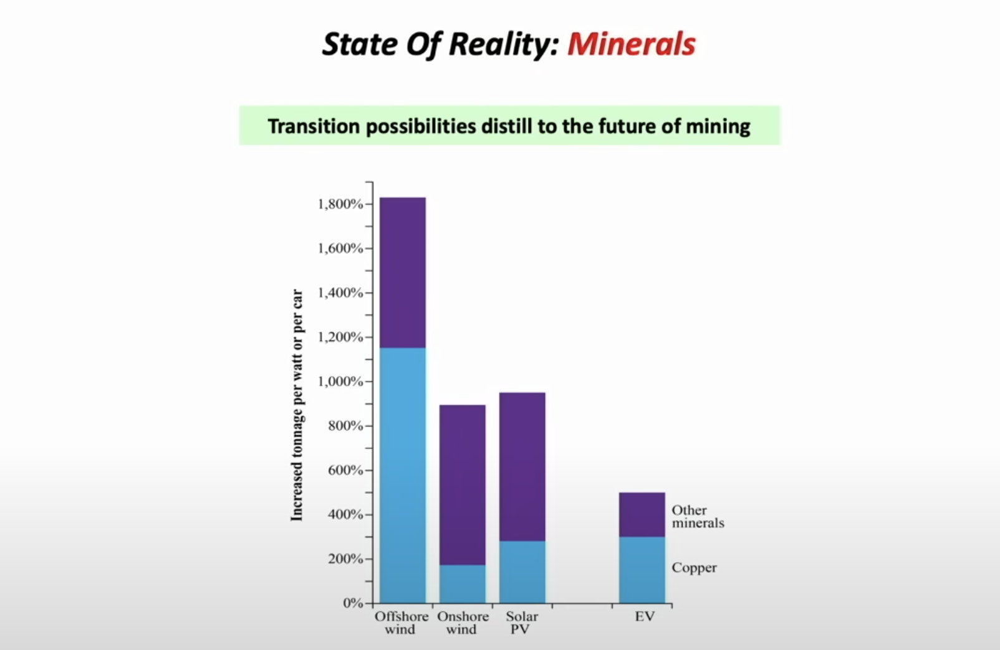

# Understanding the scale of needed metal mining for an energy transition as envisioned by western nations
## As presented by Mark Mills
Renewable energy systems require 800-1800 % more minerals to deliver the same amount of energy compared with the current fossil-fuel technologies. Electric vehicles require 400% more minerals [see figure 2].

>To convert our current energy systems as planned by Western governments, we would face the largest increase of production of metals in human history.
>
~ Mark Mills

This is because all Western governments plan on increasing energy consumption during the transition to "renewable" energy. The question always remains, is it actually sustainable to take apart our planet to mine even more resources to build green technology?

<iframe width="560" height="315" src="https://www.youtube.com/embed/sgOEGKDVvsg?si=SpxArLbni58gAdht" title="YouTube video player" frameborder="0" allow="accelerometer; autoplay; clipboard-write; encrypted-media; gyroscope; picture-in-picture; web-share" referrerpolicy="strict-origin-when-cross-origin" allowfullscreen></iframe>

## Graphics from the video presentations

### Figure 1

### Figure 2

### Critical perspective: metal mining and other-than-metal mining
This presentation focuses on minerals. It took me a second to understand that metal mining will have to increase drastically, but overall mining activity for fossil fuels will go down.

> A fossil fuel economy requires 535x more mining than a clean energy economy. 
> 
> ~ Michael Thomas, [Article in Distilled](https://www.distilled.earth/p/a-fossil-fuel-economy-requires-535x)

This doesn't make the social and environmental justice concerns regarding mineral extraction go away, but it puts them into perspective. 
# Related marbles 
The increased need for mining and extractive processes across the globe relates to my illustration [Roots of Renewables](ROOTS-OF-RENEWABLES.md).

%%
## Degrowth and prosperity
Knowing that renewable energy expansion will come at the cost of increasing eco-system damage in the Global South, everything points at *degrowth.*

We might have to redefine what it means to live a prosperous life (see [PROSPERITY-A](PROSPERITY-A.md)).

%%

