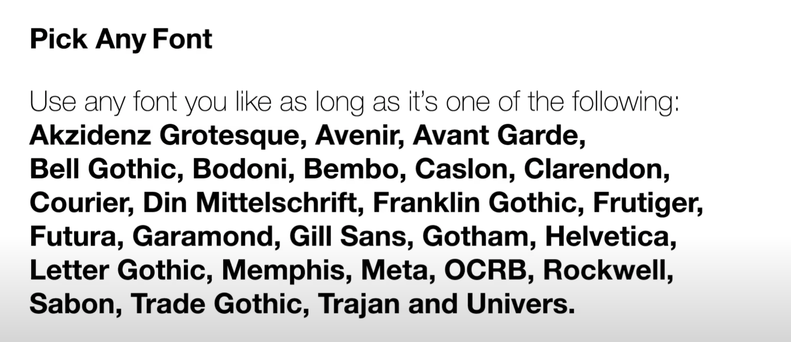
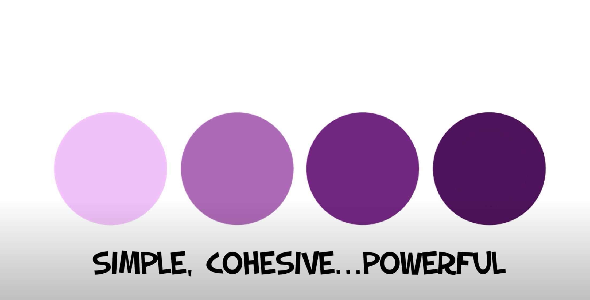
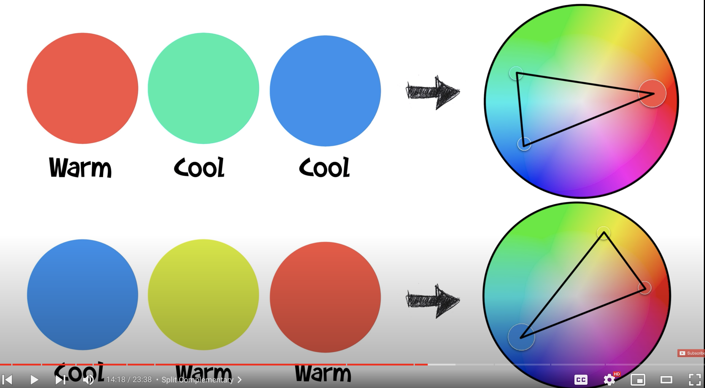
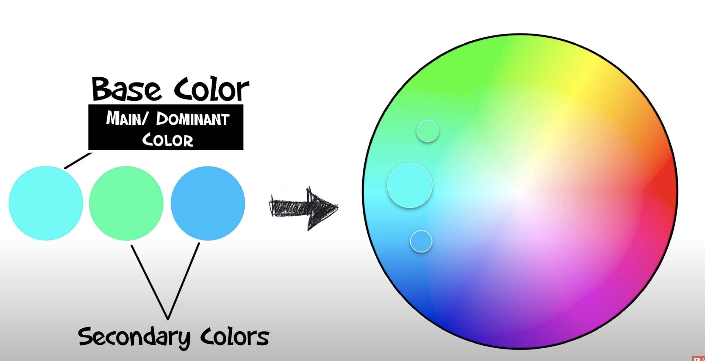
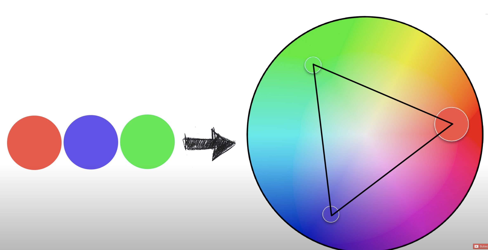
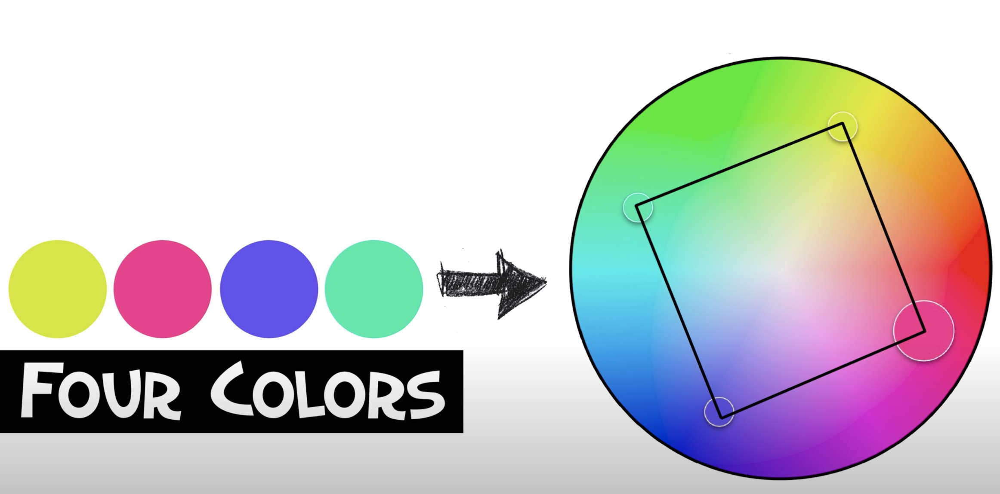

## Fonts
https://youtu.be/QrNi9FmdlxY?si=lKbYjsDri1qg7smY

### Fonts in use
Is a great website for seeing fonts in use. https://fontsinuse.com/

### anothergraphic.org
https://anothergraphic.org/

## a list of helpful graphic design websites 
https://www.instagram.com/reel/C_dLXvAP1k6/?igsh=MzRlODBiNWFlZA==

https://www.instagram.com/reel/C_aQSbhIbd1/?igsh=MzRlODBiNWFlZA==

has a link with stylish free fonts 
https://www.instagram.com/reel/C-9g6RPvgfS/?igsh=MzRlODBiNWFlZA==

## Graphic design basics

### Wonderful video about the creative process for fonts
<iframe width="560" height="315" src="https://www.youtube.com/embed/Fy3w63ar7tE?si=7vMLYmV_TBd3f0C1" title="YouTube video player" frameborder="0" allow="accelerometer; autoplay; clipboard-write; encrypted-media; gyroscope; picture-in-picture; web-share" referrerpolicy="strict-origin-when-cross-origin" allowfullscreen></iframe>

## Color theory 

https://www.youtube.com/watch?v=5m4YjFFHxRo&list=PLlxKq2s311EUKbQWnYibasS9MzH5ppMns&index=9
**Monochromatic**

**Triangular**

**less competition between colors**

**triadic color scheme - stronger contrast**

**four colors - can be overwhelming but fun and punchy**
