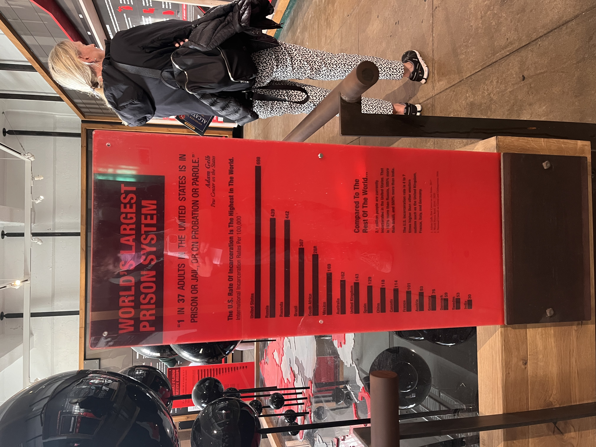

# A collection of statistics regarding incarceration in the US and beyond

*Figure from [Prison Policy](https://www.prisonpolicy.org/reports/pie2024.html?)*

*Image from the Mass Incarceration exhibit on Alcatraz*

*Images from the Mass Incarceration exhibit on Alcatraz*

## Websites

The page [Incarceration in Real Numbers](INCARCERATION-VIRTUAL-VISUAL.md) is a powerful visualization of the sheer quantity of incarcerated people in the United States. 