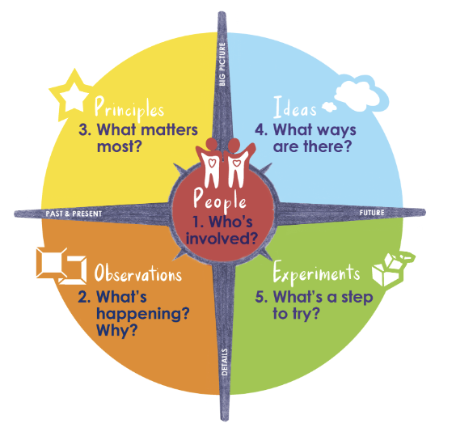

# The design tool called "Innovators Compass"
Ela Ben-Ur developed the design tool called the Innovators Compass (website [here](https://innovatorscompass.org/about)). The tool asks five questions to get unstuck during a design process or community gathering. The questions asked are: 

1. People: Who is involved?
2. Observation: What’s happening?
3. Principles: What matters most?
4. Ideas: What ways are there?
5. Experiments: What’s a step to try?

Also see [[LIBERATORY-DESIGN-A]] as a generalized framework that is embodied by the innovators compass as a tool. 

### My perspective on the compass
I associate the innovator’s compass with personal empowerment. When Ela first introduced me to the compass, it allowed me to explore my personal interests in DJing & building a sustainability-committed career during a chronically sleep-deprived and work-overloaded college semester that, by structure or design, gave very little space to personal development, not to mention self-actualization work. This meant I had almost no time to do even more work on top of schoolwork. Yet, the framework was so simple and action-oriented that it led me into very concrete experiments that were grounded in personal reflection and therefore felt meaningful enough to pursue. Right away. Do you know how hard it is to motivate a tired college student with a full course load to put intentionality into self-actualization work? I am glad Ela gave me the space and tools to go on this journey. Now, I find myself having continually outgrown my past visions of who I aspired to become. Creating a good technical project is fun, even better if you are a good designer, but what’s even better is when you can take your life into your own hands. Ela’s tip to keep my desk clean was quite useful along this path. 

Now, I find myself searching for principles and values in my life to contemplate experiments all over the place. Even in my romantic relationship, I find myself introducing the compass into planning sessions for life goals with my partner. We recently made several exciting plans for the year that will move us closer to our shared aspirations. Yet, it was always complicated to pinpoint what we should do because we had so many ideas and goals. The compass helped us synthesize our feelings and take concrete steps forward. 

The sweetness of the compass lies in actionable design results while taking a holistic perspective.

