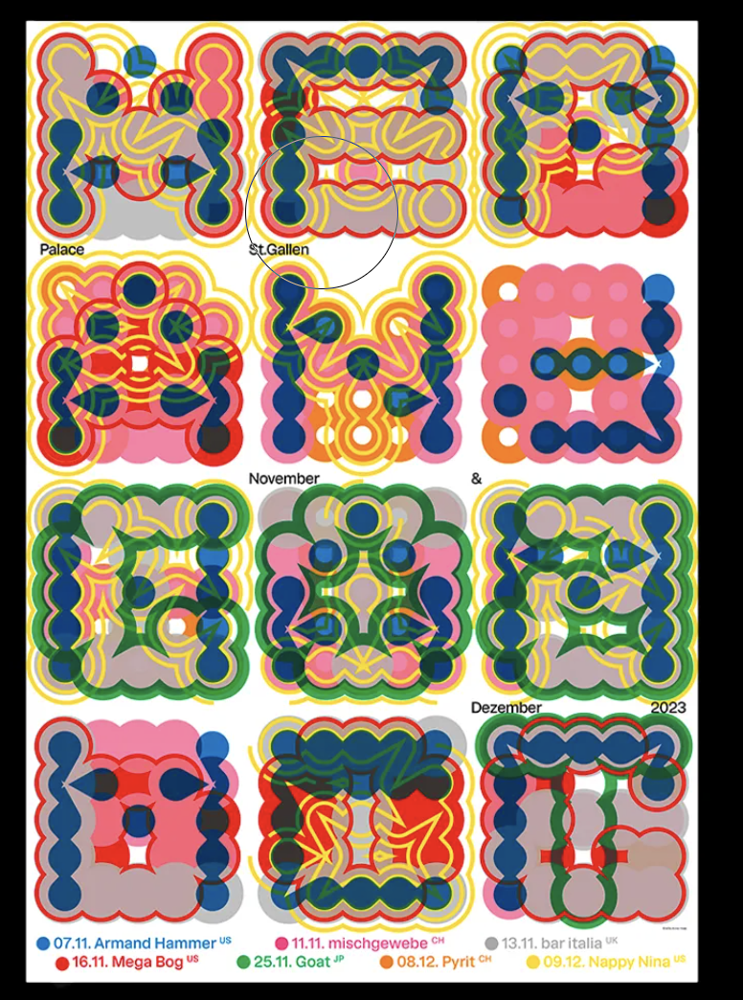
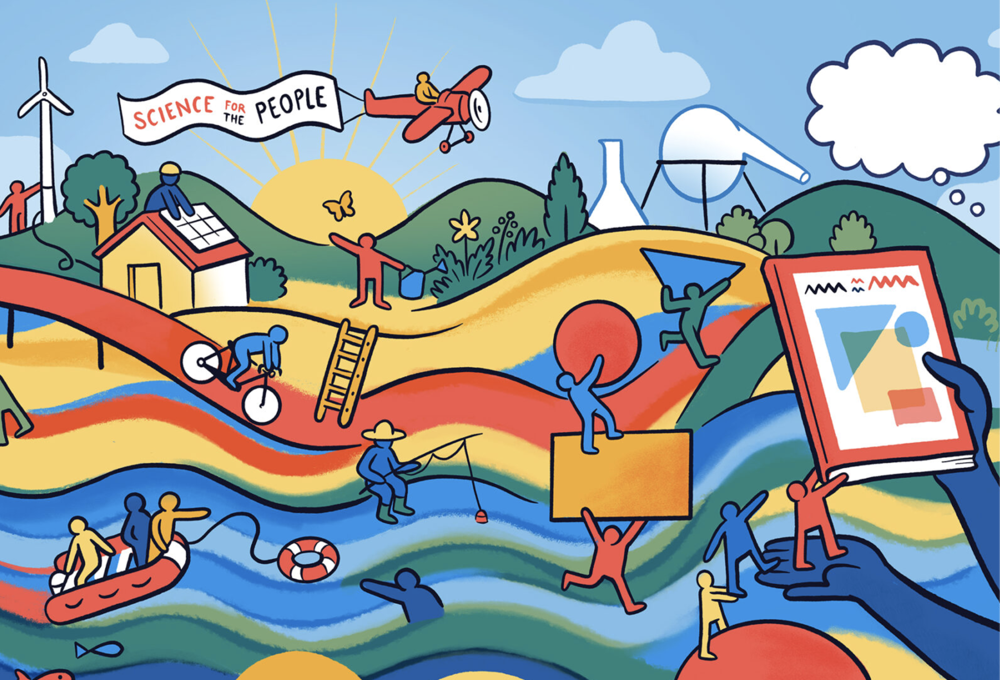
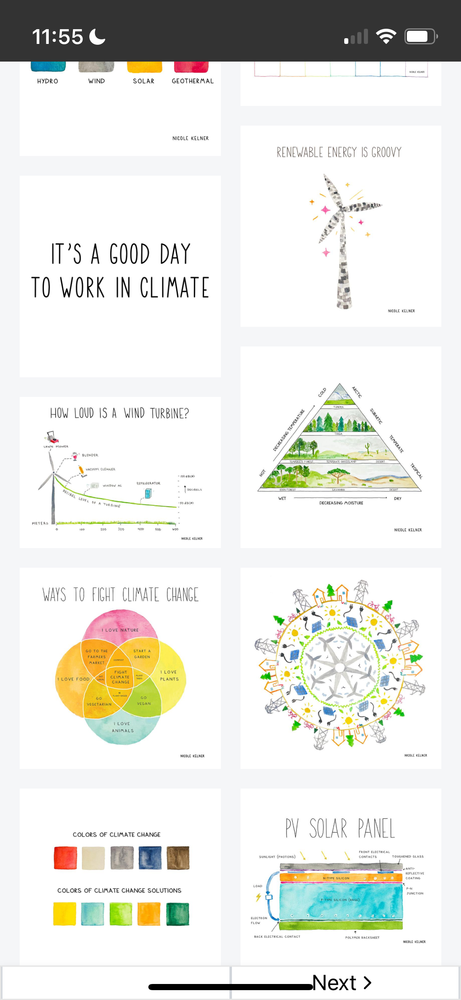
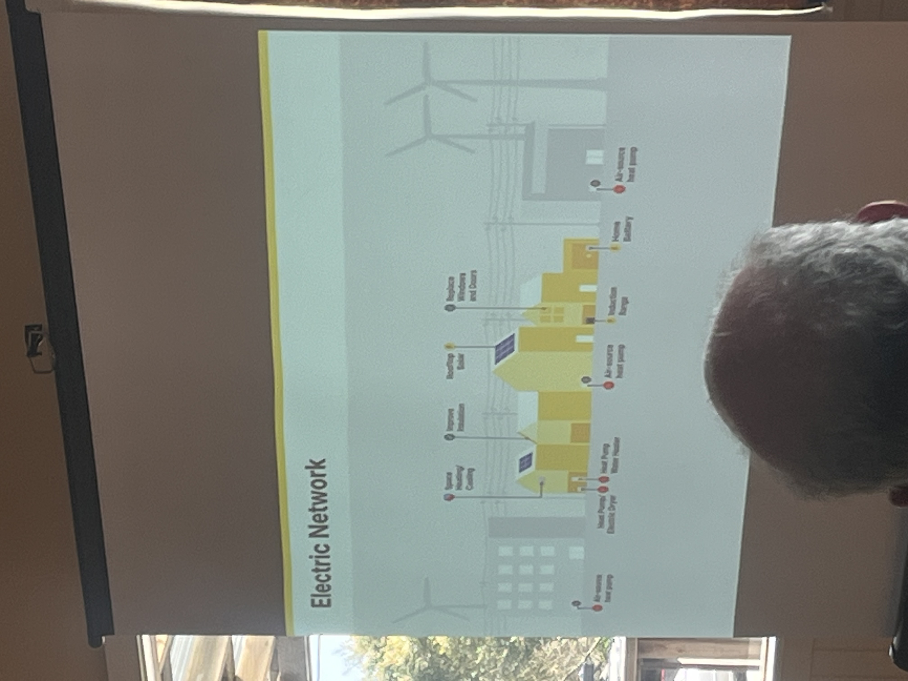

also [INSPO-DRAWING-A](INSPO-DRAWING-A.md)
# Illustrations that inspire me to create 

Anna Haas

![[media/cleanshot_2024-08-04-at-16-19-28@2x.png]]

climate art by nicole kelner
https://nicolekelner.darkroom.com/?utm_campaign=Carbonauts%27%20Community&utm_medium=email&_hsenc=p2ANqtz--qUJeSWleXlX3Z82AiUYBA6dTd0J4AuJvcpuVcAAvJaJnkRUx0NWvZQT-LdwjZ_DuayEWcNWEgrnM8yprafyAa10vK5A&_hsmi=319926782&utm_content=319926782&utm_source=hs_email

from the building decarbonization coalition (name: panama bartholony)

