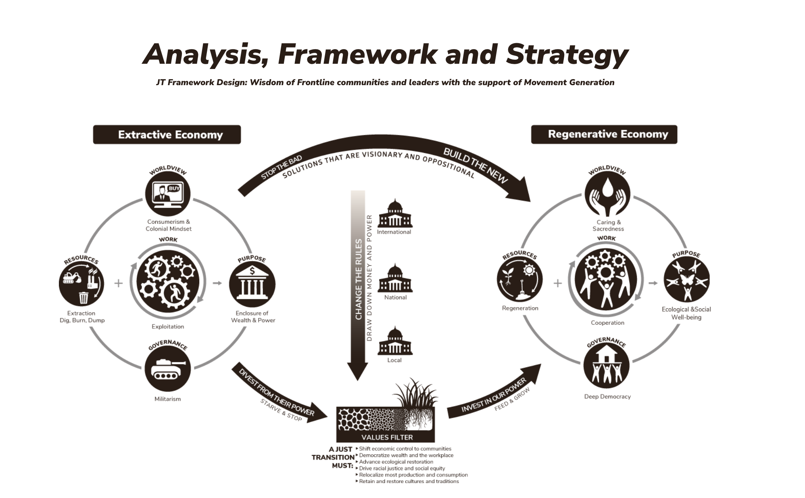

# What is a Just Transition?

>Just Transition is a vision-led, unifying and place-based set of principles, processes, and practices that build economic and political power to shift from an extractive economy to a regenerative economy. This means approaching production and consumption cycles holistically and waste-free. The transition itself must be just and equitable; redressing past harms and creating new relationships of power for the future through reparations. If the process of transition is not just, the outcome will never be. Just Transition describes both where we are going and how we get there. 
>
>~ [Climate Justice Alliance](https://climatejusticealliance.org/just-transition/)

### Here is a visual framework for the *Just Transition*
The framework depicts the idea that we need to move away from an **extractive economy** toward a **regenerative economy** (taken from the [Climate Justice Alliance](https://climatejusticealliance.org/just-transition/)).

Examples of both types of economies are listed in the graphic.

## The Principles
- **Buen Vivir**: Advocates for living well without harming others, emphasizing the fundamental human rights to clean air, water, land, food, education, and shelter, and promoting just relationships with each other and nature.
- **Meaningful Work**: Focuses on developing human potential and creating opportunities for all to learn, grow, and contribute to society in a way that is life-affirming.
- **Self-Determination**: Stresses the right of all peoples to participate in decisions that impact their lives, with an emphasis on democratic governance and community control over economies.
- **Equitable Redistribution of Resources and Power**: Aims to transform social inequities based on race, class, gender, and other forms of oppression, and to reclaim resources for regenerating communities most affected by these inequities.
- **Regenerative Ecological Economics**: Encourages the creation of systems that are ecologically resilient and economically sustainable, while reducing resource consumption and restoring biodiversity.
- **Culture and Tradition**: Values the inclusion of diverse cultures and traditions as vital to a healthy economy, and calls for reparations for historical injustices, including those related to land and culture.
- **Solidarity**: Recognizes the interconnectedness of communities and issues, and calls for global solidarity to address imperialism and militarism.
- **Builds What We Need Now**: Urges immediate action to create and expand alternatives to extractive practices, building the foundation for a just and sustainable future.
%%
## The Just Transition Framework

%%

________

#values #framework 