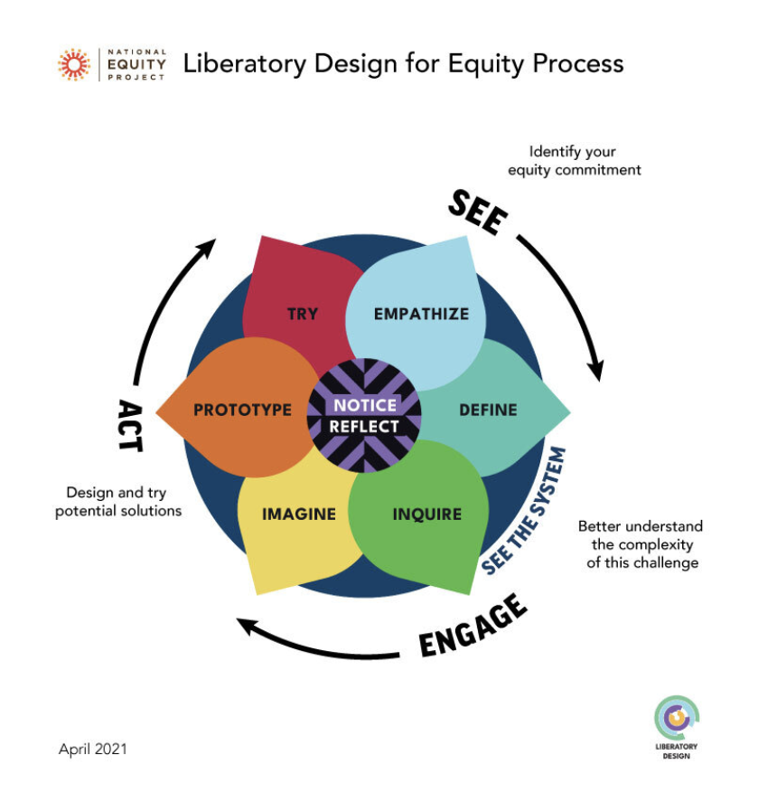

# The Liberatory Design for Equity Process
## A framework

### Related marbles
See the [[INNOVATORS-COMPASS-A]] for a concrete design practice which implements this general process.

The [Wheel of Oppression and Liberation](OPP-LIB-PRAC-A.md) reflects on the aspects of life, to which we need to pay attention in order to transform oppressive patterns into liberatory ones. 