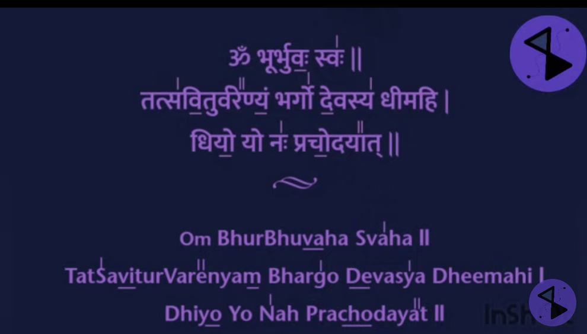

# The Gayatri mantra
The Gayatri has 24 syllables, and is listed below with phonetic pronunciation in brackets:

Om bhuh, bhuvah, swaha (Aumm Bhoor Bhoo-va Su-va-ha)

Tat savitur varenyam (Tat Sa-vee-toor Var-ayn-yam)

Bhargo devasya dhimahi (Bar-go Day-vas-ya Dhee-ma-hee)

Dhiyo yo nah prachodayat (Dhee-yo Yo Nah Pra-cho-da-yaat) [1]

*In the video below, they sing the last line: Dhiyo yo nah prachodayahane*

<iframe width="560" height="315" src="https://www.youtube.com/embed/GCuu8Ri9G-o?si=OGwcRCE28G5QJ1S1" title="YouTube video player" frameborder="0" allow="accelerometer; autoplay; clipboard-write; encrypted-media; gyroscope; picture-in-picture; web-share" referrerpolicy="strict-origin-when-cross-origin" allowfullscreen></iframe>

# A word-for-word translation is:
- Om: The primeval sound
- Bhur: The human body, earth, physical realm, existence
- Bhuvah: The vital energies, heaven, consciousness
- Suvah: The soul, inner space, spiritual realm, bliss
- Tat: That
- Savitur: The Sun, solar powers
- Varenyam: To choose, the best, adore
- Bhargo: Effulgence, self-luminous, divine light
- Devasya: The divine, radiant
- Dhimahi Dhiyo: the intellect
- Yo: Which
- Nah: Our, of us
- Prachodayat: Illuminate, inspire [1]
# The meaning of the Gayatri Mantra 
A general translation of the mantra is:

O Divine mother, may your pure divine light illuminate all realms (physical, mental and spiritual) of our being. Please expel any darkness from our hearts and bestow upon us the true knowledge. [1]

Translations vary, but Vyaas Houston’s is among the most accessible : “Earth, atmosphere, heavens. We meditate on the sacred light of the effulgent source. Let that inspire our thoughts.” Stuck on the word “effulgent”? Merriam-Webster’s defines it as “radiant splendor,” but in a yogic sense, it refers to the all-pervading light of the celestial realms. [1]

__________
[1] - https://www.yogabasics.com/connect/gayatri-mantra/

