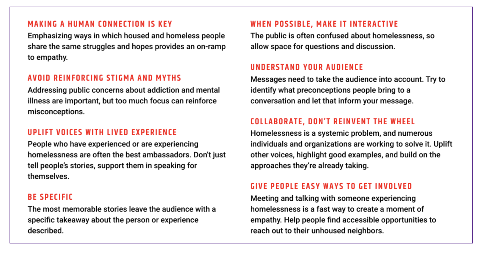

# Movement building principles for media creation

The podcasters Damon Williams and Daniel Kissinger created a list of emancipatory media principles. They define media as any medium that **connects people, ideally to humanize each other, reflect, and build movement**. In their work, they seek to humanize subject-to-subject conversation. 

They seek to create media to **enable activation, education, and archiving**.

Their practice of media creation is aligned with the following principles followed by the seventh principle inspired by their overarching conversation:

1. Operate without being beholden to traditional institutions
2. Acknowledge and create within contradiction (within you or your story)
3. Name people and organizations that are already doing the work. 
4. Direct resources that are not focused on productivity to your community.
5. Let your actions be guided by ground work and relationships rather than access to power.
6. Attempt to account for colonial power structures & implications in ourselves, dialogue, and the work we do. 
7. Share which problems are important through the lens of the organizations doing the work.

%%
## An example for changing the narrative to have more productive conversation and create direct action (regarding homelessness)

from [invisible people](https://invisiblepeople.tv/stories-from-homeless-people/)

more places that interrupt the dominant narrative:
- https://www.humansofnewyork.com/tagged/inmate-stories

## When you communicate about your work, start with the why, then move to how and what
Simon Sinek describes that this communication approach is more fruitful than starting with the what. See video and notes on [MARKETING-RESOURCE-A-WHY-HOW-WHAT](MARKETING-RESOURCE-A-WHY-HOW-WHAT.md).
%%