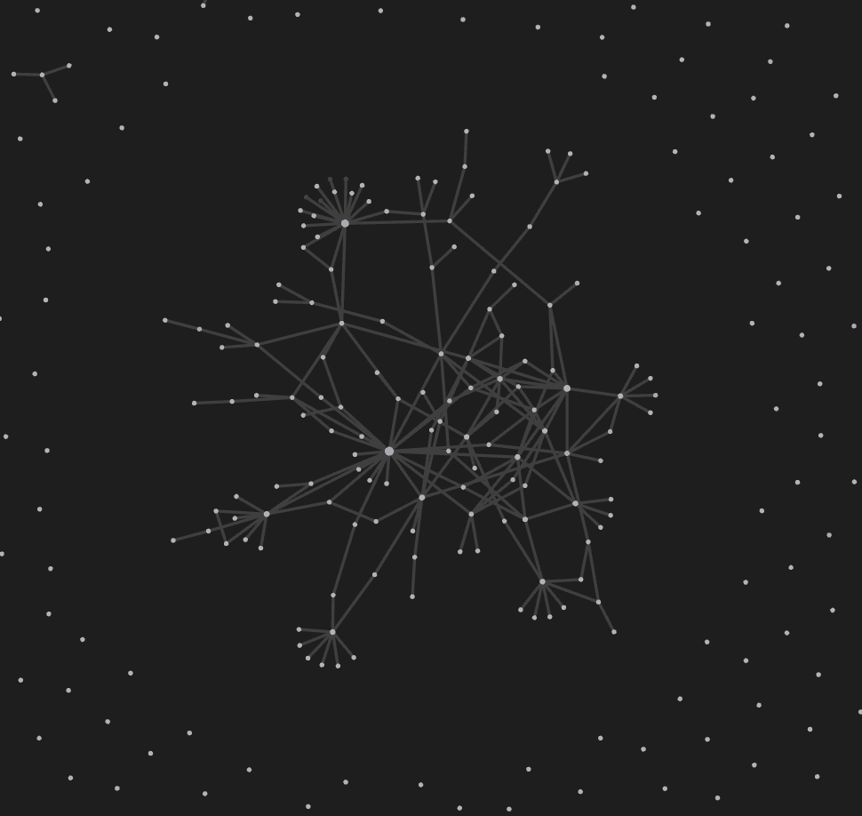

# List of tools useful for a sharpened intellectual and creative practice

>Dear MESH students, 
>
My name is leon (they/any), and I went through the MESH program as part of the first-ever cohort. During my time, I observed very particular struggles concerning the management of large amounts of research papers, the management of knowledge obtained from all sorts of discussions and papers, and the creative work flow that drives our self-driven projects.
>
For instance, I noticed that many students didn't know that citation managers existed (why would you unless someone tells you?). During my actual [MESH capstone project](MMSSystemicCooperationInterface-A.md), I interviewed knowledge management experts and have since then learned a lot about **writing down insights in ways that are useful to my future self**.
>
With this learning journey in mind, I want to share with you a set of resources that might considerable ease your flow through MESH (and empower your sharp thinking).

### Citation managers
 It helps to know that citation managers exist and which ones are good and free. Citation managers are software solutions to manage large amounts of research papers, create references, and create mark ups: [Zotero](https://www.zotero.org/) is great, free, open source solution. It is one of the industry standards for saving resources, creating citations lists, annotating PDFs, and saving images from papers. There are many other citation managers. Do your own research (but PDF annotation is hard to come by for free). I am sharing this one because a huge community of coders constantly develops new features for it (because it is open source).

### Knowledge management - the extension for your brain
One step after reading research papers, you might have particular concepts or insights that you want to save for your future self or for a future paper you want to write. There is a particular system that a lot of PhD students and researchers use to organize their findings and knowledge called [Zettelkasten](https://christiantietze.de/posts/2020/10/zettelkasten-introduction/). Click on the previous link to learn about it in detail.

I sadly didn't know about this system early enough, but I started taking notes half way through my MESH program. Here are a few examples of how I use it (I also host this website using the same system (but you don't need to do that - you can keep it private)): 

- [Overview Capitalism](OVERVIEW-CAPITALISM.md)
- [Overview Circular Economy](CIRCULAR-ECON-A.md)
- [Agriculture and Climate Change Statistics](AGRICULTURE-A.md)
- [Mineral Realities of the Energy Transition](ENERGY-ENG-A.md)

In my opinion, the best, most powerful, and free software to organize your knowledge is called [Obsidian](https://obsidian.md/). Tools like Notion are also nice but because they are not as simplistic, it becomes hard to know where and when to save information. Obsidian, everything is one atomic bit of information. It allows you to interlink any insight or piece of knowledge with another one (which you can't easily do with documents in Notion). And you can even look at them visually. This is my web below:

*Figure shows the web of all my notes and how they are interlinked. Green dots refer to tags, grey dots refer to actual notes.*

### How do I use citation managers and knowledge management software together?
This is an article that explains how a citation manager can be used in fusion with the "zettelkasten" (e.g. [Obsidian](https://obsidian.md/)) knowledge management approach: [An Updated Academic Workflow: Zotero & Obsidian](https://medium.com/@alexandraphelan/an-updated-academic-workflow-zotero-obsidian-cffef080addd)

### Other nice software tools for brainstorming 
- Miro (or Figma) are online tools to create mind maps, sticky notes etc... There are very few mind map tools out there. It really helps to have access to one! **You can have access to both of these with an educational account!** (maybe lie about the lenght of your program to have access for longer).
	- Figma is a very powerful tool. You can create simple mindstorming/jamming files or detailed graphics.
	- Miro is a simple great tool. It does not offer advanced graphic design options. 

- Canva is a great tool to create presentations based on stock imagery and generally free. 

## Looking at MESH as an apprenticeship. What work tips would the *master of MESH* give you?
Since I graduated from a college that teaches every student basic design skills, I had realized many times in my life that using paper and pen is superior to any software tool. Everyone works differently. 

One of my best purchases in the last three years was a roll of butcher paper and a butcher paper cutter. Seriously. I sooo recommend it to explore a topic without the stressful blank screen of a note taking software.

Below is a list of physical helpers that I keep around at all times:

- Heavy duty sticky notes
- Butcher paper 
- Sharpies
- Colored pens
- A normal sized notebook (that doesn't feel to valuable to use)
- A small sized notebook for lists
- A small portable white board
- Maybe: cork plates for pinning up notes and ideas

**If I learned anything from design school, it is that shaping our work space with artefacts of our thoughts and ideas is essential for progression on a design/research journey.**

 >All of this is my perspective. Take what helps you and leave everything else behind. There is no wrong way to do creative work, but I wanted to share these because I see an opportunity to reduce struggle and increase joy along the way. 
 >
 >Reach out any time! My contact info is on my website:
 >[leonsanten.info](https://leonsanten.info/)

%%
## Looking at the work of MESH as an apprenticeship. What work tips would a *master of MESH* give you? 
You don't know the value of something that you have never practiced. Unless someone introduces you to having the tools below around yourself, you won’t get them. More money to spend... Yes, but it's worth it! We used to work with paper for decades. Now laptops are here and we are deprived of creative work flows on our desks. We need to re-engage this practice. This collection is quick tool-focused re-angement. 

Learning how to pour out your thoughts & explore your creative source may require more than materials. In the end, it's about how one work with their creativity. But it is incredibly difficult to be creative without writing things on paper, moving them around, and shaping a physical space. 

%%