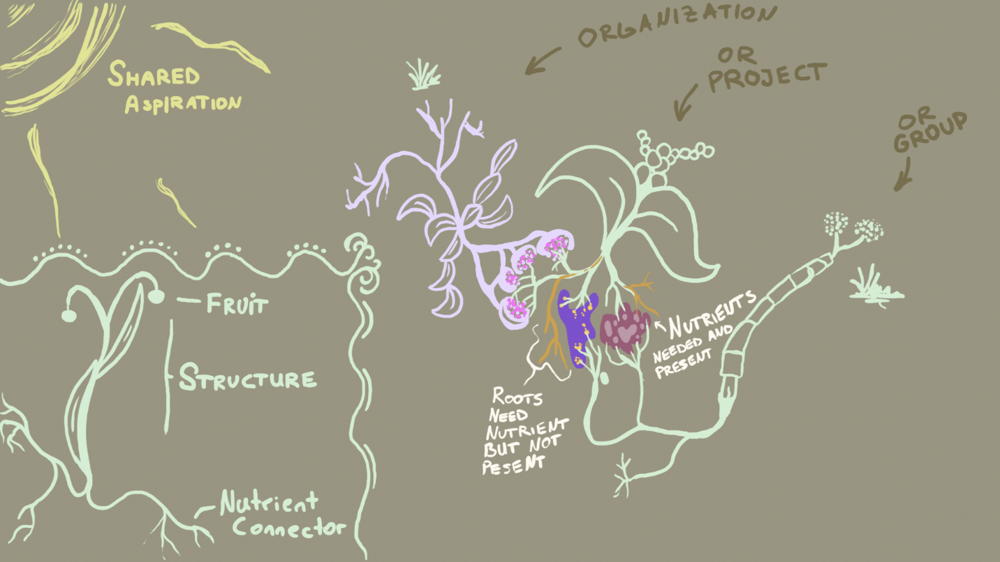
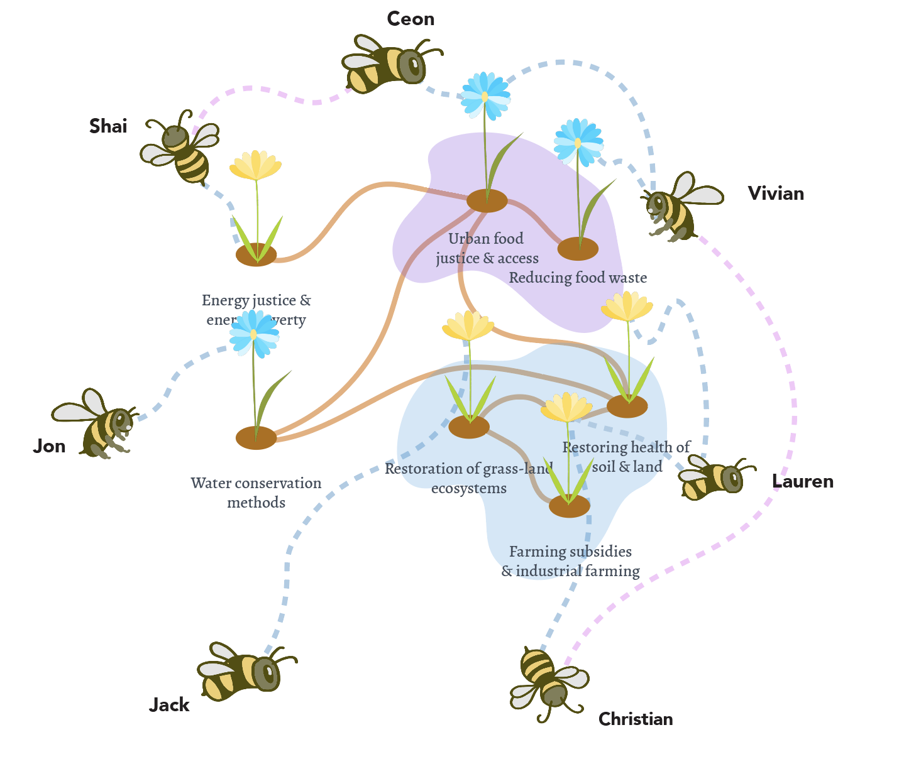
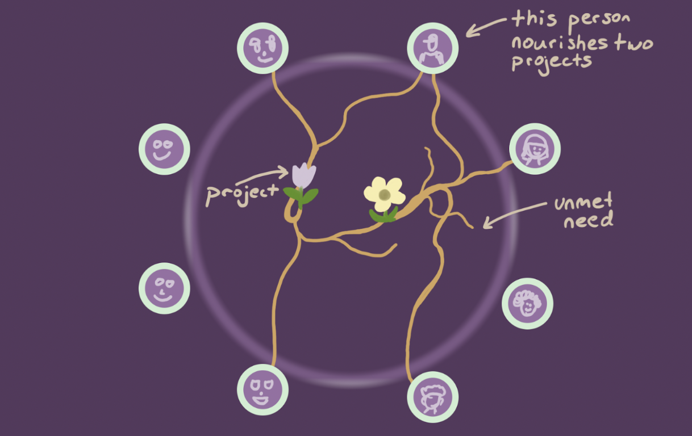
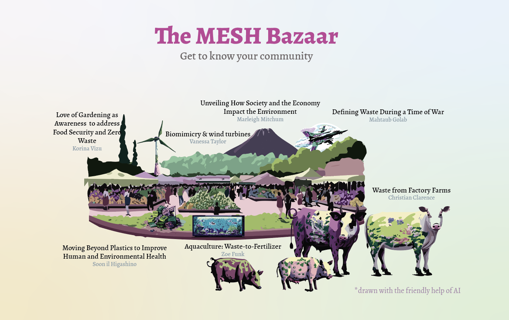

# How do we visualize the systemic relationships (good or bad) of organizations?
Throughout all my work, visual representations of systemic relationship bubble out of my brain and hands. Over time, I started to develop metaphors that work across different domains, mainly inspired by nature. I have become natures apprentice, learning from phenomena in ecosystems and applying them to my engineering, design, and community-building work. 

Trees, roots, nutritional storage, soil, fruits, DNA, seeds. Just as plants require nutrients, have needs, and can be supportive or extractive, social systems have similar characteristics.

*Big parts of this work arose during my master's thesis and participatory design study on trans-disciplinary cooperation (more over [here](MMSSystemicCooperationInterface-A.md)).*

## The general idea: projects emerge and interconnect via sharing nutrients 
I visualize projects as plants because our social structures take on a life force by themselves (see this marble on this [phenomenon](AUTOPOIESIS-A.md)). Furthermore, the components of a plant resemble the components of organizations that exist to grow certain fruits, need to maintain specific structures to do so, and require a wide range of nutrients.

## Humans tend to their collective garden of projects while relating to each other
I thought about this framework for a long time. I wanted to find a visual that can depict the relationship between humans and also their project. I currently think of it as a garden, in which humans nurture their projects (plants) collectively. Regarding trans-disciplinary cooperation, the task will be to engage in communication that facilitates the growth of our plants and health human beings. 

## Visuals are very helpful to make sense of complexity

## Another metaphor: roots

Above illustration currently in the works... ([ROOTS-OF-RENEWABLES](ROOTS-OF-RENEWABLES.md)). This visual also relates to [Ethical Supply Chain Design](MMSEthicalSupplyChainViz.md). 

## How does this work relate to other *marbles* I want to share with you?
The Just Transition Principles, for instance, are rooted in values such as “care, cooperation, and consent.” Companies that uphold other values such as “growth” or “profit” plant these values as they plant seeds for new organizational structures. These values continue to live on in them.

Values can be considered the essence of social structures. Read more about them in the marble on [ontological primitives](ONTOLOGICAL-PRIMITIVES.md).

It is the most *radical* thing to go back to these value roots and approach building new regenerative systems from this perspective (see [RADICALNESS](RADICALNESS.md) for more on what this means).

