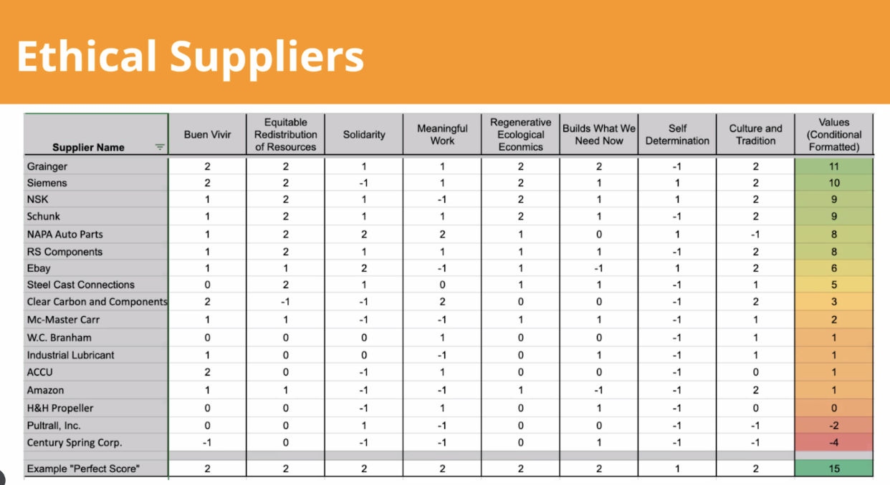

# How do we visualize the systemic relationships (good or bad) of organizations?
Below is a metaphorical framework I developed to explore the relationships between various projects and organizations. Just as plants require nutrients, have needs, and can be supportive or extractive, social systems have similar characteristics. 

Throughout many parts of my work, I have become natures apprentice, learning from phenomena in ecosystems and applying them to my engineering, design, and community-building work. 

*Big parts of this work arose during my master's thesis and participatory design study on trans-disciplinary cooperation (more over [here](MMSSystemicCooperationInterface-A.md)).*

## The general idea: projects emerge and interconnect via sharing nutrients 
I visualize projects as plants because our social structures take on a life force by themselves (see this marble on this [phenomenon](AUTOPOIESIS-A.md)). Furthermore, the components of a plant resemble the components of organizations that exist to grow certain fruits, need to maintain specific structures to do so, and require a wide range of nutrients.

## Humans tend to their collective garden of projects while relating to each other
I thought about this framework for a long time. I wanted to find a visual that can depict the relationship between humans and also their project. I currently think of it as a garden, in which humans nurture their projects (plants) collectively. Regarding trans-disciplinary cooperation, the task will be to engage in communication that facilitates the growth of our plants and health human beings. 

*I acknowledge that the drawing below is a little sketchy. More to come in the future...*

## Why we need visuals

## What do the roots of our "sustainable" engineering projects look like?

Above illustration currently in the works... ([ROOTS-OF-RENEWABLES](ROOTS-OF-RENEWABLES.md))
## How do we visualize our supply chains to grasp their effects on the world?
The table below investigates the "wrongdoing" or socially regenerative practices embodied by companies needed for the supply chain of the wind turbine owned by the Just Energy Hub at Olin College of Engineering (researched by Ashley Nicole Zarasua, Lily Mesri, Tara Birgani). This list is based one the [just transition principles](https://climatejusticealliance.org/just-transition/).

I am currently wondering how to represent these scores and numbers in a visual container such as a flower with differently sized pedals. **Do you have ideas? Please let me know! **

## How does this work relate to other *marbles* I want to share with you?
The Just Transition Principles, for instance, are rooted in values such as “care, cooperation, and consent.” Companies that uphold other values such as “growth” or “profit” plant these values as they plant seeds for new organizational structures. These values continue to live on in them.

Values can be considered the essence of social structures. Read more about them in the marble on [ontological primitives](ONTOLOGICAL-PRIMITIVES.md).

It is the most *radical* thing to go back to these value roots and approach building new regenerative systems from this perspective (see [RADICALNESS](RADICALNESS.md) for more on what this means).

