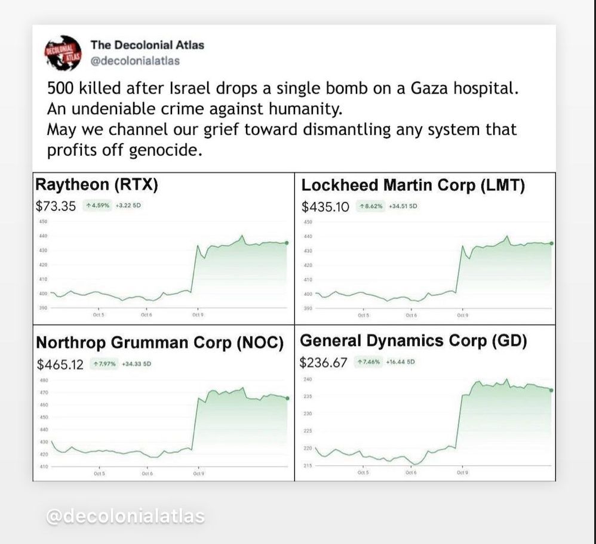

# Statistics surrounding the scale of the US military industrial complex
## An attempt to develop intuition
I have a hard time making sense of numbers on their own. This is my attempt to put numbers into global context and get a grasp of the (invisible) flows that keep our world entrenched in violence. For more marbles on this topic, refer to slides in [MILIT-B](MILIT-B.md), focusing on the relationship of the military ind. complex to climate justice. 
## The US Department of Defense (DoD) is the second largest employer world-wide with 2.9 million people
The single largest employer is the Indian Ministry of Defense. India had a population of 1.42 Billion people in 2022. The United states had a population of 333 Million people in 2022 [1].

If the US had the population of India and kept its ratio, its military apparatus would reach 12.4 Million people, 4.15x the size of the current Indian Ministry of Defense. 

Worded differently, per capita, the US DoD is 4.15x larger than the Indian Ministry of Defense. 

## US Yearly defense expenses are at least 2.21x larger than the one-time "milestone" investment from the Inflation Reduction Act to fight climate change 

The section of Biden's Inflation Reduction Act (IRA) that seeks to address climate change is $ 369 billion large [2]. This is a major milestone in US history concerning climate change-related initiatives. Compare this with the yearly fiscal expenses for defense that amount to $ 816 billion for 2023 [3]. This is a ratio of 2.21x. The IRA is a one-time act, defense expenses happen yearly. 

The US Government shipped $ 75 billions of weapons to Ukraine.

US military buys as much fuel as Portugal, emits more than Romania, and other heavy-emitting nations (see [[MILIT-B]]).

## US Fiscal military expenses have risen in the last years
The numbers below and above are directly taken from the US Government reports. Independent research, however, claims that military expenses reached 1.53 Trillion in 2022 instead of the the official numbers of $ 766 Billion due to a limited categorization on the US Government's end [5]. 

- U.S. military spending/defense budget for **2021 was $800.67B**, a 2.86% increase from 2020.[6]
- U.S. military spending/defense budget for **2020 was $778.40B**, a 6% increase from 2019.[6]
- U.S. military spending/defense budget for **2019 was $734.34B**, a 7.6% increase from 2018.[6]
- U.S. military spending/defense budget for **2018 was $682.49B**, a 5.53% increase from 2017. [6]

## The Department of Defense (DoD) is likely the largest employer of engineers in the US

In the article [Defense Department Engineers Drive Mission Success](https://www.defense.gov/News/News-Stories/Article/Article/2942301/defense-department-engineers-drive-mission-success/), issued by the Department of Defense, Barbara McQuiston states that the Dod is "likely the largest employer of engineers in the United States, and the department will need even more to continue to protect the nation" [4].

>"The DOD has over 100,000 engineers, and they are incredibly important to us," McQuiston said. "You can imagine the range of capabilities and personnel that we have working on the hardest problems — from civil engineers and software engineers to material engineers and chemical engineers — just a whole range of engineers looking at some of the toughest problems for DOD. We couldn't function without them. They touch everything that we do. [They] create the possibilities for the future and the solutions we need for today." [4]

### Many technological innovations go back to DoD research and design funded by tax dollars (not the free market)
"McQuiston said things like transistors, cell phones, 5G cellular technology, computers and the internet all point back to DOD investments." [4] This piece of info could be used to infer that we need the DOD for innovation, or it could be used to infer that the competitive, laissez-faire free market is not innovative enough on its own and that public investments are important to steer the advancements in our society "correctly." This insight can essentially be taken as a counter argument against the neoliberal arguments that the free market has brought about all the amazing technological advancements we have today. Instead, it becomes obvious that political investments and funding are crucial to steer progress in the right directions. 

## World-wide military expenses compared with official development assistance (ODA)
While the graphic below illuminates the asymmetry between military financing and other forms of financing. ODA is not specifically peace building 

%% RESOURCES FROM JERRY
https://www.financeforpeace.org/

https://www.interpeace.org/event/enhancing-partnerships-for-financing-peace/#:~:text=Key%20messages.%20New%20partnerships%20with%20key%20actors,success%20of%20many%20mitigation%20and%20adaptation%20projects. %%

[7] - UN report

## The capitalist market and the military industrial complex
Regarding the violent nature of our social systems, also look at Alvares's take on how the [scientific method is deeply violent in nature](https://archive.unu.edu/unupress/unupbooks/uu05se/uu05se07.htm) and intertwined with colonialism & capitalism. Also see [my timeline illustration](MMSHistOfSci-A.md) that visualizes the concepts & ideas that influenced the evolution of the scientific method, which has co-evolved with the technology-centric innovation & development paradigm.

________
## References

[1] - https://www.statista.com/chart/3585/the-worlds-biggest-employers/

[2] - https://www.usatoday.com/story/money/2023/05/25/guide-to-the-inflation-reduction-act/70249464007/

[3] - https://www.defense.gov/News/News-Stories/Article/Article/3252968/biden-signs-national-defense-authorization-act-into-law/

[4] - https://www.defense.gov/News/News-Stories/Article/Article/2942301/defense-department-engineers-drive-mission-success/

[5] - https://monthlyreview.org/2023/11/01/actual-u-s-military-spending-reached-1-53-trillion-in-2022-more-than-twice-acknowledged-level-new-estimates-based-on-u-s-national-accounts/

[6] - https://www.macrotrends.net/countries/USA/united-states/military-spending-defense-budget

[7] - https://www.un.org/peacebuilding/sites/www.un.org.peacebuilding/files/documents/financial_flows_for_peacebuilding.background_note.210124.layout2.pdf