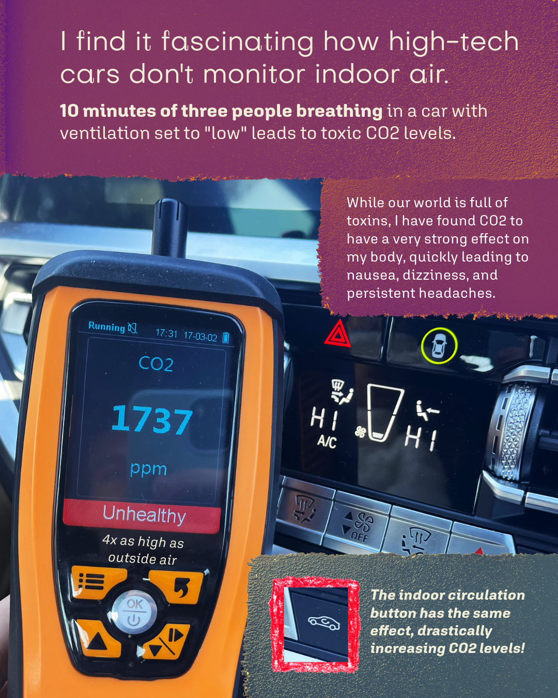
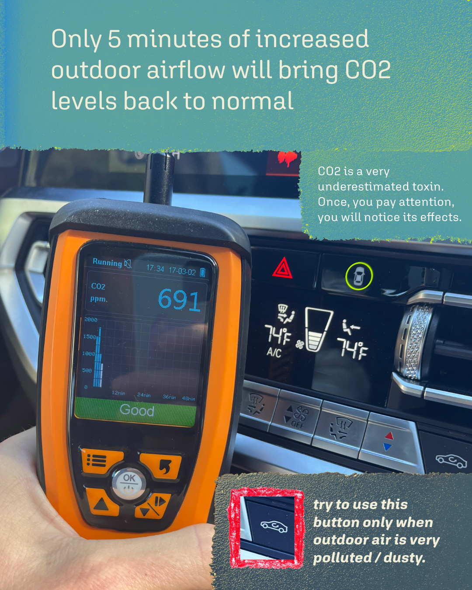
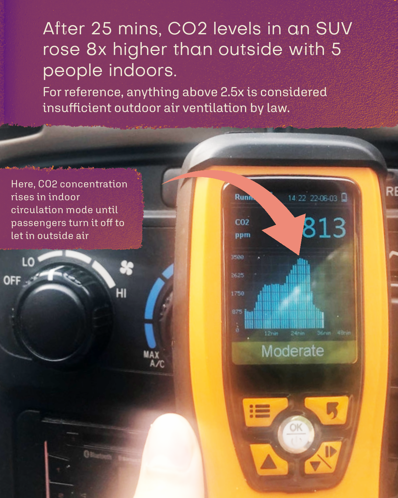

# CO2 levels in cars
I have been travelling with my air quality measurement device for 2 years. While public buildings' air quality is highly controlled by law (has to be below 1100 ppm), private spaces are not, including cars and air conditioning systems for private houses.

Because CO2 is invisible and odorless, it is very hard to understand its effects because there are so many toxins around us that can make us feel nauseous - e.g. coffee, plastic fumes, car rides, work stress.

