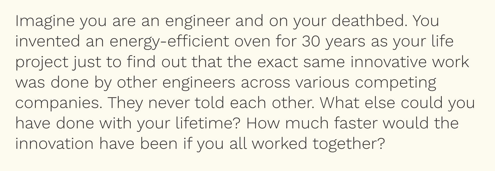

# Intellectual property is wasteful and threatens our planet

Imagine you are an engineer and on your deathbed. You invented an energy-efficient oven for 30 years as your life project just to find out that the exact same innovative work was done by other engineers across various competing companies. They never told each other. What else could you have done with your lifetime? How much faster would the innovation have been if you all had worked together?

https://www.omprakash.org/blog/radical-solutions-for-a-circular-economy

#MMS-seed #MMS-post #todo