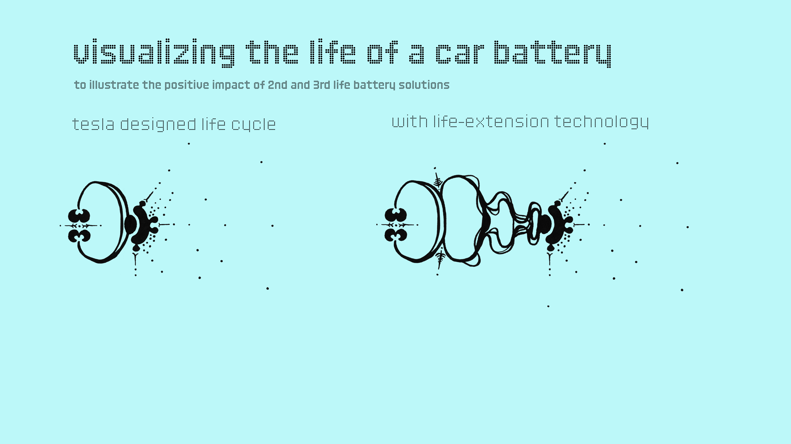
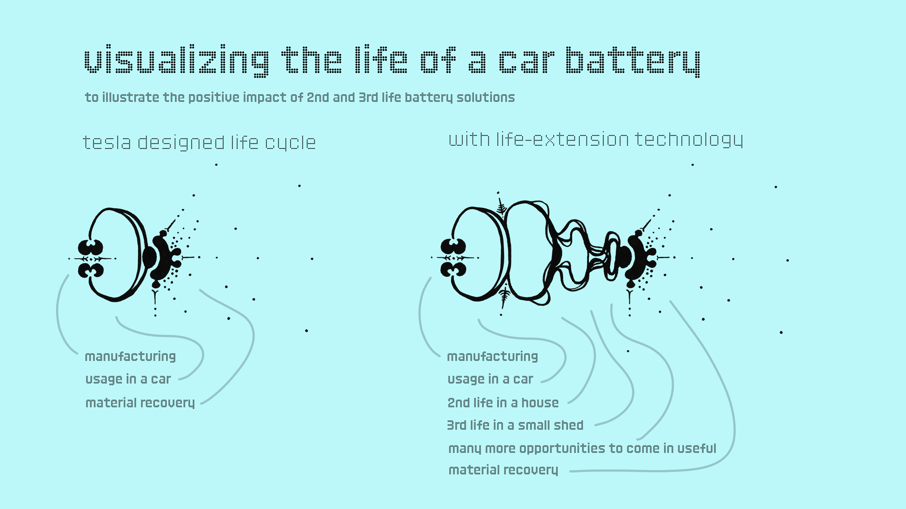
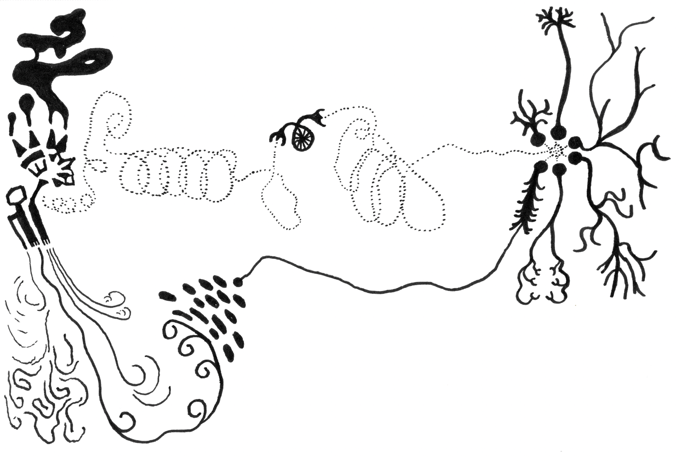

# Visualizing the life of a car battery
## With and without life-extension technology
This visualization grew out of a project to visualize the amazing potential behind ReJoule technology that can scan decommissioned EV batteries to ensure that they can be safely operated in their 2nd and 3rd life. 

While this technology should be a given to build a [circular engineering economy](CIRCULAR-ECON-A.md), it is not even allowed by California law (in Jan. 2025). 

### Another drawing that visualizes the same concept 

### Related marbles
- I have some thoughts on agency over battery charging of laptops to allow users to keep their devices healthy at [MMSHealthTechCommuniA](MMSHealthTechCommuniA.md)