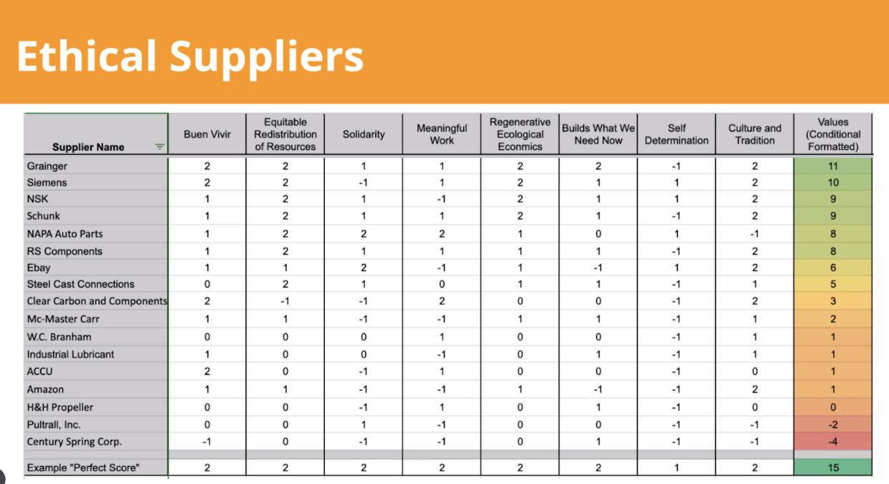

# How do we communicate the regenerative potential of suppliers
## An ethical supply chain and visualization study

**Problem**: We need a simple visual to show how regeneration-conducive a company or organization really is.

______
### Related marbles
I have scattered list of metaphorical exploration of systemic and organizational relationships in my marble called [Metaphorical Relationships of Orgs](METAPHORICAL-RELATIONSHIPS-OF-ORGS.md).