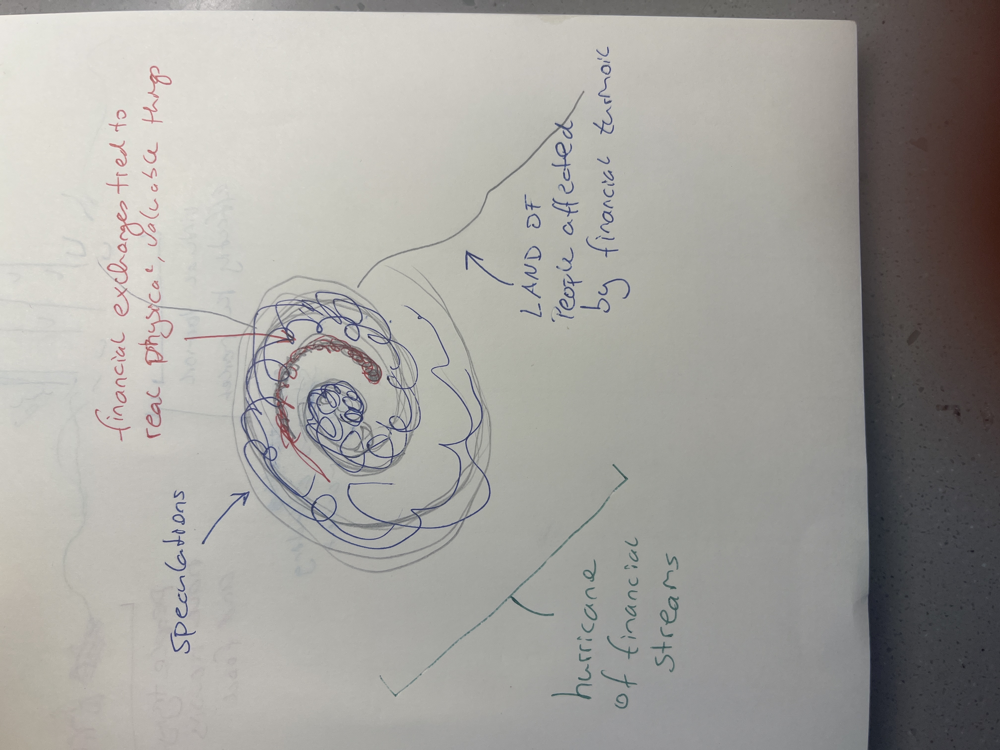
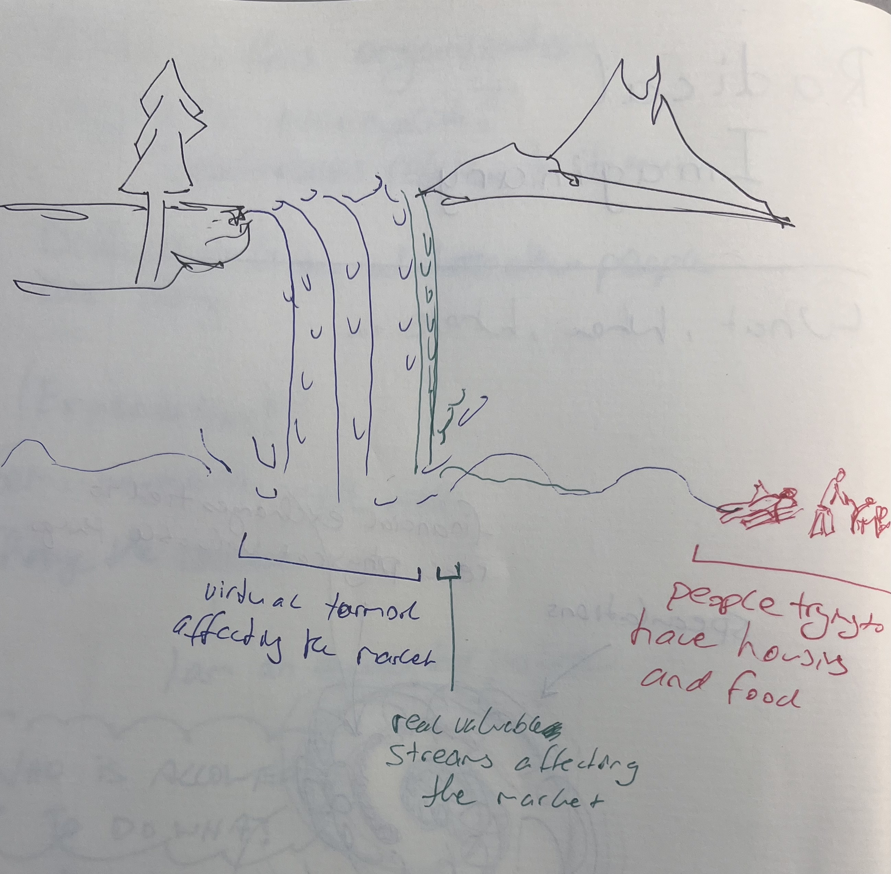

# Most of the international transactions on this planet are not tied to any real valuable thing
## Gambles serving no social purpose but affecting everyone 

*This is a sketchy note.*

>The total value of foreign exchange transactions worldwide amounted to US$ 1.5 quadrillion (1 quadrillion is 1,000 trillion) in 2010, whereas the total value of international trade was only US$ 20 trillion, or less than 1.4 percent of all foreign exchange transactions. Says Lawrence Lau, professor of economic development, emeritus, Stanford University, and chairman, CIC International (Hong Kong): “The overwhelming majority of foreign exchange transactions are thus purely speculative, in effect, pure gambles, and serve no useful social purposes."
>
~ Otto Scharmer & Katrin Käufer, p.5

## Ways to visualize 

**The hurricane of global monetary flow**

**The splashing waterfall affecting everyone**

### Additional ideas 
- the water could water could nurture mostly nothing and one plant. 

______
## References
Scharmer, O., & Käufer, K. (2013). Leading from the Emerging Future: From Ego-System to Eco-System Economies (1st ed., p. 304). Berrett-Koehler Publishers.

_______

#visualization-idea #illustration-idea
