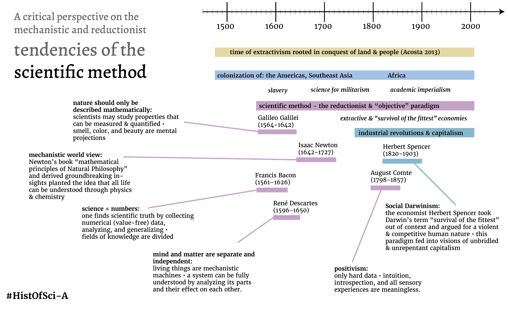

# A critical synthesis: history of the scientific method
## People and world events that shaped the scientific method

This might trigger you: we need to be aware of the limitations of the scientific method. 

I am not saying that we should never be using the scientific method. It is a tool out of many.

Take a look at the core ideas that have given rise to this form of obtaining knowledge. 

Can you see how these ideas create separation and alienation?

The scientific method does not account for values. It largely focuses on numbers.

Yet, values are core to the human existence. 

Any stance someone takes to fight climate change is based on what we as humans value and hold sacred: the right to live and thrive. 

Science has brought about amazing innovation. Yet, we see massive social and ecological destruction. 

### Science, violence, and militarism 
I can recommend this article by Indian sociologist Alvares contemplating why the  [Western scientific method is deeply violent in nature](https://archive.unu.edu/unupress/unupbooks/uu05se/uu05se07.htm) and intertwined with colonialism & capitalism.

### Values embedded in the scientific method
While Francis Bacon and others claimed that science is value free, this position holds up values of *reductionism* in itself. To disregard values or the talk about values, is a political stance. Regarding this, two works are important.

1. Habermas said that any science pursuit contains "knowledge constitutive interests." I explain this concept in [MMSPhilOfSciA](MMSPhilOfSciA.md).
2. Values (if extractive or healing) reproduce themselves in the social structures we create. There are inherent values of reductionism and quantification embedded in the scientific method, and these values will stay alive in systems arisen from such scientific work. The concept of [ONTOLOGICAL-PRIMITIVES](ONTOLOGICAL-PRIMITIVES.md) describes the idea that values are the smallest building blocks of our social systems. I tried to visualize how such ontological primitives reproduce themselves in an illustration linked above. 