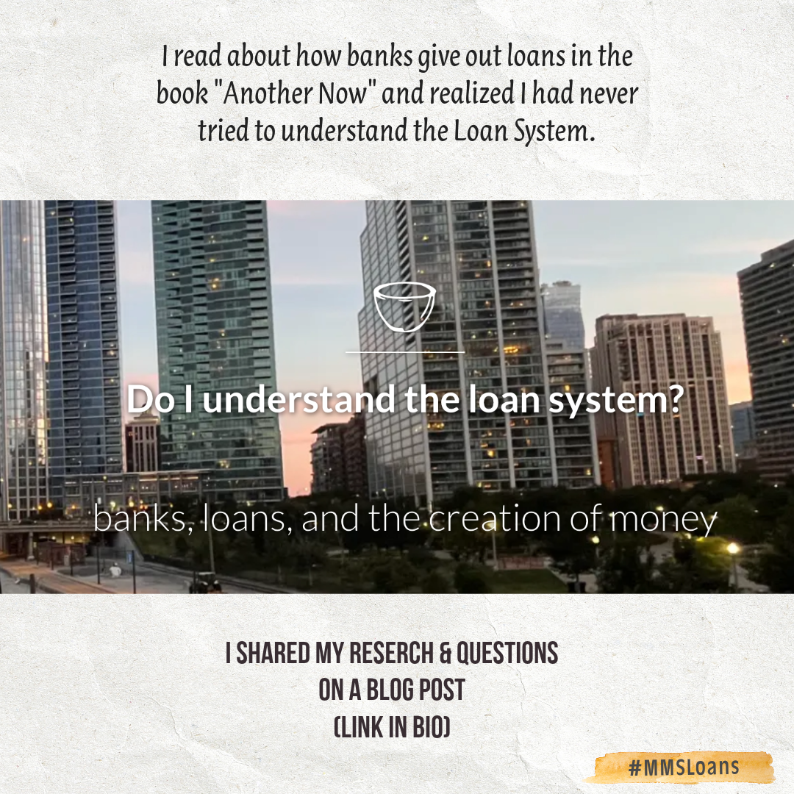
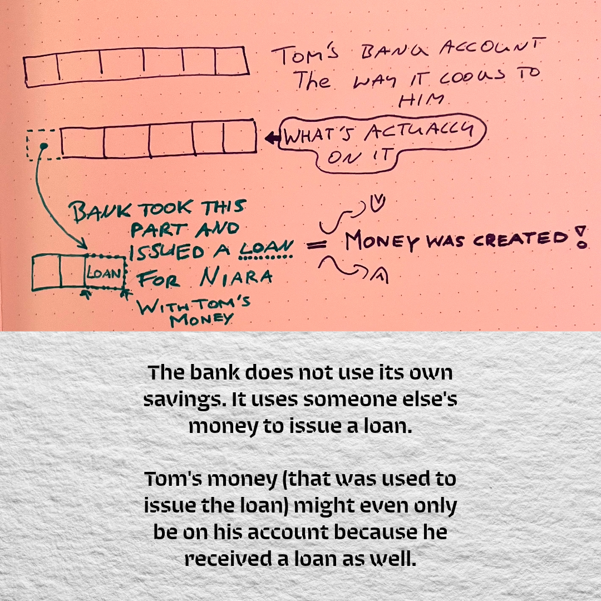
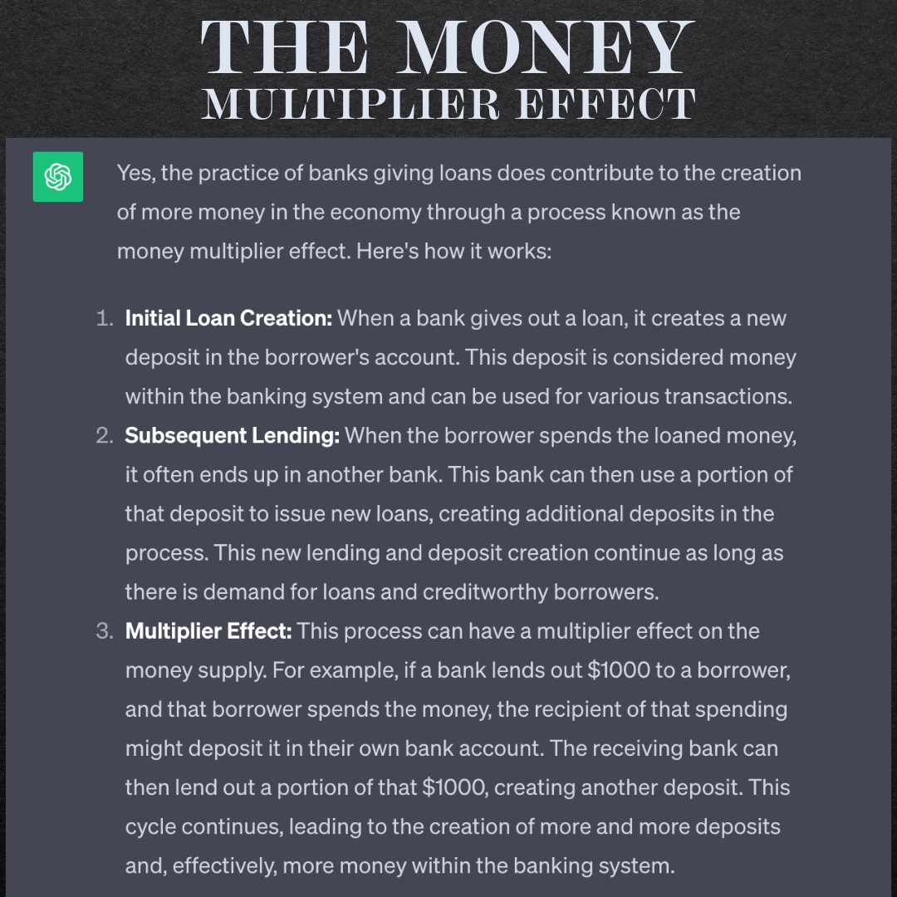

# The problems around issuing loans (the way banks are allowed to do it)
thoughts are shared on my blog post https://www.omprakash.org/blog/just-transition-blog-reflection--3

In general, I am still unsure if it is ok to have interest rates on loans. Wouldn't that require the need to make more profit? Or does it make sense to only invest into things with the intention that they sustain themselves? 

