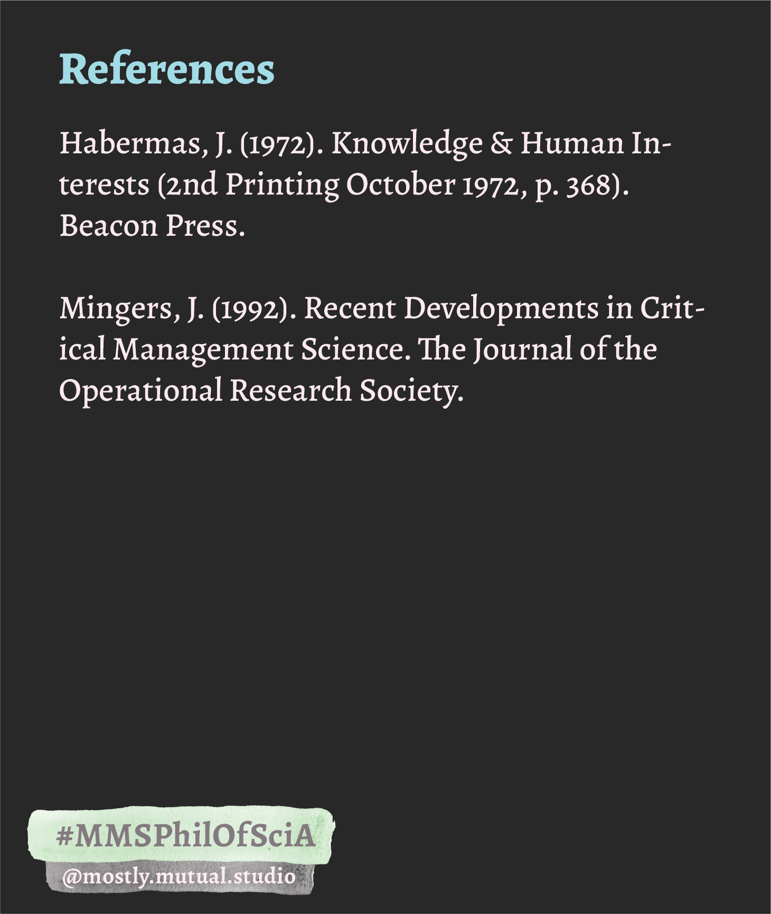

# Building blocks for my philosophy of science

### This table should have queer methodologies

## Other pieces that could important in the right context

>science needs to be more scientific by investigating the various possibilities in an undogmatic way. and reason, too, should not be dogmatic"problematic: if we don't see the assumptions we have made, we don't see the limitations of the model 
>
>~ McGilchrist 2021

________
### References

Habermas, J. (1972). Knowledge & Human Interests (2nd Printing October 1972, p. 368). Beacon Press.

McGilchrist, I. (2021). The Matter With Things: Our Brains, Our Delusions, and the Unmaking of the World (p. 1500). Perspectiva.

Vanasupa, L., & Barabino, G. (2021). An engineering education of holism: einstein’s imperative. In M. Bouezzeddine (Ed.), Insights into global engineering education after the birth of industry 5.0. IntechOpen. https://doi.org/10.5772/intechopen.99211

________

#MMS #publicBubble
#philosophyOfScience #sticker

%%
## Random Notes

ADD TO REFERENCES (vanasupa & barabino 2021) 
## what does this mean for academic communication?
*from a conversation with Ciara*: I think standards are incredibly important. I just wish that we could come together and contemplate these standards. How do we want to talk to each other? If one interest of the social sciences is  "intellectual development and communication," what do we envision for the shape of academic papers (Vanasupa & Barabino 2021)? If the critical sciences seek some sort of liberation, what does that mean for our papers?

Currently, the standard "paper methodology" seems to have arisen from the monologue-style analytical, technical paper realm. But if particular sciences like the critical and social sciences focused more on the communication relationships that a paper creates, the structure of papers might look completely different. 

LINKS

https://www.theguardian.com/environment/2024/oct/25/we-have-emotions-too-climate-scientists-respond-to-attacks-on-objectivity

%%