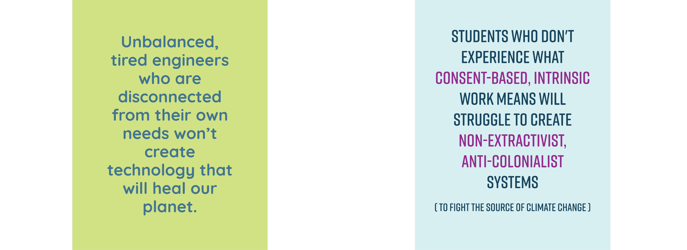

# What environments aid the emergence of a regenerative future?
Generally speaking, I argue that our system's capacity to be conducive to health & wellbeing is re-created in the systems that emerge from it. This is the autopoietic (self-reproducing) effect of social systems. As these systems are self-referential, the new structures they create carry the embedded values, beliefs, purpose of the parental  systems (also called [[ONTOLOGICAL-PRIMITIVES]]).

This is why we need to pay very close attention to the value-roots of our the systems we create.

The illustartion below is particularly influenced by systems thinking insight that *you can never force or control the emergence of something, you can only provide conditions that are conducive to the emergence of desired outcomes.* This way of relating to creating new systems tends to be unintuitive to engineers who are trained to control and predict. 

## A visual metaphor... 
This illustration is part of a blog post that explores the self-referential (autopoietic) nature of social systems. Read more via the blog article on [frameworks for energy justice](https://www.omprakash.org/blog/frameworks-for-a-just-energy-network) over here.

### References from the illustration:
- [Just Transition Principles](https://climatejusticealliance.org/just-transition/)
- [Jemez Principles for Democratic Organizing](https://climatejusticealliance.org/jemez-principles/)
- [Democratizing engineering education - Zastavker & Venkatesh 2020](https://aic-atlas.s3.eu-north-1.amazonaws.com/projects/e7299991-eb2b-4764-a849-4909e01fb07d/documents/SZhHUrNGR0SUQ7lGQ8eQbX24UHw2HCzr6sV9DTR2.pdf)
- [Wellbeing Blueprint](https://wellbeingblueprint.org/blueprint/)
- [White supremacy characteristics](MMSWhiteSupremacy-A.md)

### Tangential insight: People (or systems) fragmented themselves will recreate fragmentation through their creations
An engineer, for instance, creates social and material structures. If the engineer lives with large (energetic) blockages between their emotional side, physical body, and work, they are likely to create new systems that similarly create blockages between these parts.

Values and beliefs can be considered as the essence that continues to exist throughout someone's creations. If a software engineer, for instance, values productivity and does not value regeneration and balance, they will not be able to code a social media platform that helps us to build regenerative systems. Think about it, when have you head Mark Zuckerberg talk about nurturing caring friendships? I couldn't find a single interview about this matter with him.

A response to this illustration from a friend who went to Princeton: "Yeah i think both quotes resonated with me-in particular the first quote about how engineers disconnected from their own needs won’t produce technologies that can heal the planet -i was reminded of my undergrad engineering experience and how disconnected i felt from myself during that time. I felt that the culture in engineering felt very much colder and very separate from oneself, or that may have been just my experience in engineering at the least"

## Monica Dennis's "Wheel of Oppression and Liberation"
This framework emphasizes how oppression & colonization were only possible due to the disconnect between mind and body [[SOMATIC-HEAL-WHITENESS]].

By re-connecting to and remembering our (collective) selves we can tune into embodied knowledge and power to create deep, radical change ([[OPP-LIB-PRAC-A]])

## Our ability to connect with each other emerges autopoietically from our ability to relate to ourselves

Here, McGilchrist would say that shapes are a secondary phenomenon emerging from relationships [[MCGILCHRIST2021-VID]].

_______

#engineering #recreation #education 

