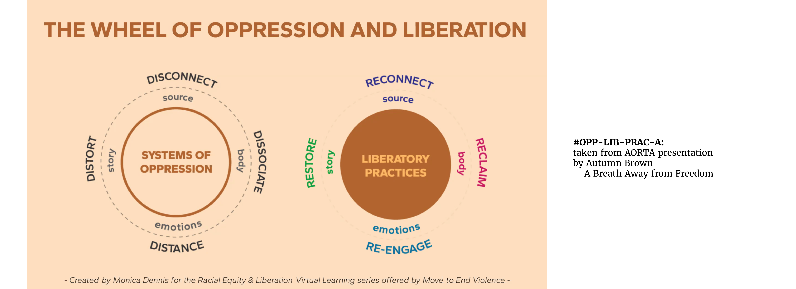

# What environments aid the emergence of a regenerative future?
Generally speaking, I argue that the system's capacity to be conducive to health & wellbeing is re-created in the systems that emerge from it. This is the autopoietic (self-reproducing) effect of social systems. As these systems are self-referential, the new structures they create carry the embedded values, beliefs, purpose of the parental  systems (also called [[ONTOLOGICAL-PRIMITIVES]]).

## What conditioning of the environment leads to the emergence of health? 
This drawing is part of a blog post that explores the self-referential (autopoietic) nature of social systems.
Read more via the blog article on [frameworks for energy justice](https://www.omprakash.org/blog/frameworks-for-a-just-energy-network) over here.

The way communication is accepted and rejected within social systems may be rooted in values that condition structures. These structure are conducive to the emergence & growth of certain seeds and not others. 
### References from the illustration:
- [Just Transition Principles](https://climatejusticealliance.org/just-transition/)
- [Jemez Principles for Democratic Organizing](https://climatejusticealliance.org/jemez-principles/)
- [Democratizing engineering education - Zastavker & Venkatesh 2020](https://aic-atlas.s3.eu-north-1.amazonaws.com/projects/e7299991-eb2b-4764-a849-4909e01fb07d/documents/SZhHUrNGR0SUQ7lGQ8eQbX24UHw2HCzr6sV9DTR2.pdf)
- [Wellbeing Blueprint](https://wellbeingblueprint.org/blueprint/)

### Therefore, people (or systems) that experience disconnection between parts of their system will recreate similar structural patterns as they create new systems
An engineer, for instance, creates social and material structures. If the engineer lives with large (energetic) blockages between their emotional side, their physical body, and their work, they are likely to create new systems that similarly create blockages between these parts. Values and beliefs can be considered as some of the essence that continues to exist through someone's creations. If the engineer values productivity and does not value regeneration and balance, their social media platform they are building as a software engineer will likely condition the behavior of users with their  respective value system (see [[ONTOLOGICAL-PRIMITIVES]] for more detail on values). 

#engineering #recreation #education

from a friend who went to princeton at the time: "Yeah i think both quotes resonated with me-in particular the first quote about how engineers disconnected from their own needs won’t produce technologies that can heal the planet -i was reminded of my undergrad engineering experience and how disconnected i felt from myself during that time. I felt that the culture in engineering felt very much colder and very separate from oneself, or that may have been just my experience in engineering at the least"

## Monica Dennis's "Wheel of Oppression and Liberation"
This framework emphasizes how oppression & colonization were only possible due to the disconnect between mind and body [[SOMATIC-HEAL-WHITENESS]].

By re-connecting to and remembering our (collective) selves we can tune into embodied knowledge and power to create deep, radical change ([[OPP-LIB-PRAC-A]])

## Our ability to connect with each other emerges autopoietically from our ability to relate to ourselves

Here, McGilchrist would say that shapes are a secondary phenomenon emerging from relationships [[MCGILCHRIST2021-VID]].