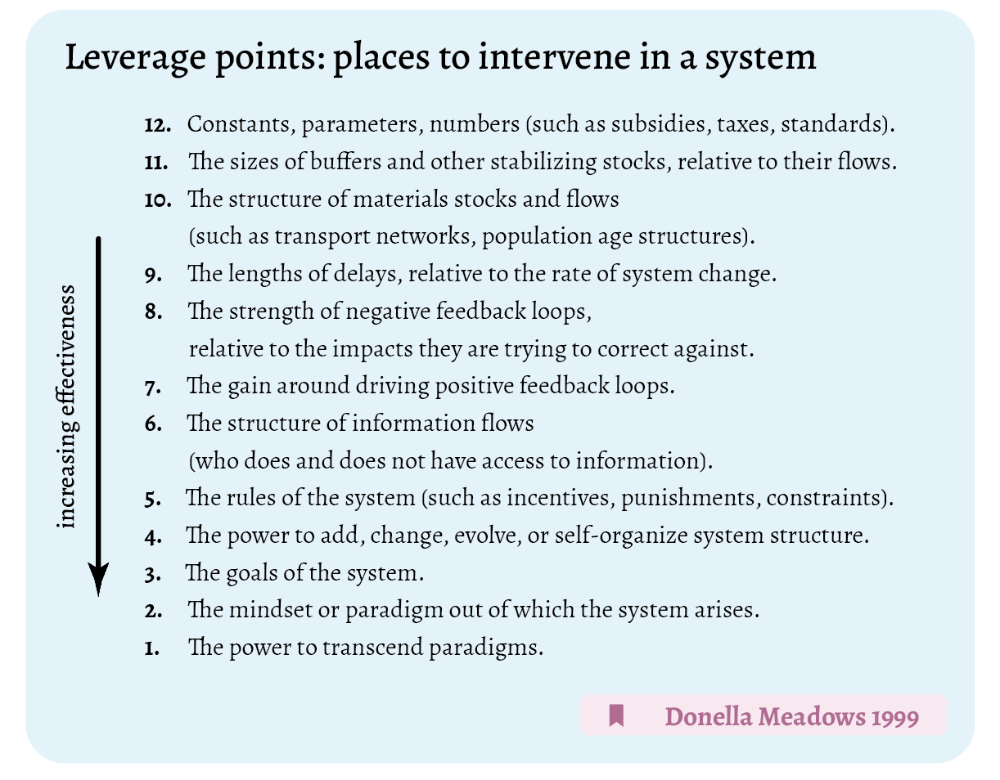

# How to intervene in living systems, which are considered complex systems

Gordon Brander wrote an [article](https://open.substack.com/pub/subconscious/p/places-to-intervene-in-a-system?r=17iyv7&utm_medium=ios) about this list, including many insightful quotes.

______

#MMSSeed #leveragePoints #quote 

______
### References

Meadows, D. (1999). _Leverage Points: Places to Intervene in a System - The Donella Meadows Project_. http://donellameadows.org/archives/leverage-points-places-to-intervene-in-a-system/