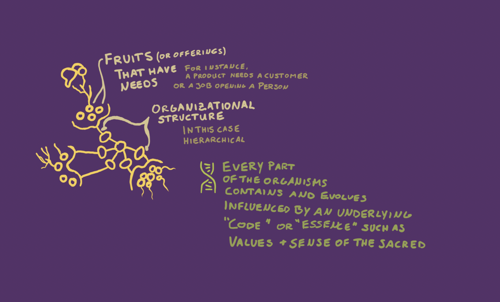

# Building a practice and visual space for trans-disciplinary cooperation

For the last two years, I have been on a quest to understand what forms of communication my community of local and international change makers requires (see my [master's thesis](https://www.omprakash.org/blog/leon-capstone-blog-week-14-overview)).  

Many friends of mine have voiced the need to sense each other better (to let emerge action); for complex climate change projects but also group sensing and reasoning such as understanding who wants to live on a farm in the next 10 years. 

Here, we might think about digital tools right away. However, I am very cautious of building tools before we understand what we truly need. Therefore, I decided to dedicate my master's capstone project to this inquiry. I talked to collaboration experts, knowledge management innovators, interviewed climate change activists, and co-envisioned practices and spaces for climate justice work with my fellow students and change-maker friends. 
## We need *communication about communication*

A digital tool might help to keep the flow of nutrients going. Tools can also help to ease understanding of a landscape. But tools are only as useful as the human practice they support or elicit.

>I see great power in visuals because complex processes can simply not be expressed or easily understood through linear frameworks. Yet, almost all of our digital communication spaces provide linear communication feeds. 

## Everything starts with building relationships as whole humans

Through organizing my network of scientists and activists across disciplines, I have learned that every group wants to engage in vastly different ways. Metaphorically speaking, every group of people wants to have a different *communication living room*. The idea of such a *communication living room* arose naturally during many interviews. 

## The communication living room below features communication components requested by interviewees within my master's community

On a conceptual level, I want to emphasize that we can think of interfaces as places for information. We need to pay close attention to the structure of these places because structure conditions behavior.

Below is an adjacent design construct that I developed to share project work with people to continue *movement building* within the project's field. Why is this important? Well, we don't care about sharing a project to brag. **We want to share so others can jump on the train**. But to do that, we need to share about particular parts of the project. The information container below needs more work but is based on the  [movement building media principles](MEDIA-MOVEMENT-BUILDING-A.md) , which have proven to be very effective in developing the design concept below. I hope it makes sense! 

### The work described in this *marble* (or post) arose during my capstone project visualized below

Please not that many ideas arose prior to the official capstone project because I investigated this question for two years peers, professors, and local communities.

If you want to read my full thesis paper, I invite you to follow this [blog post](https://www.omprakash.org/blog/leon-capstone-blog-week-14-overview), which links to the full paper.

## More on using nature as a useful visual metaphor
As I continue my work of using visuals to raise understanding of social & ecological processes and relationships, I build on my visualization frameworks depicted below. 

First of all, I conceptualize projects as plants that grow due to the nurturing care of humans. Humans essentially tend to a garden. 

Secondly, the plants grow structures to grow fruits and reproduce. They grow roots that draw and exchange nutrients. Social systems similarly create (social )structures to grow specific fruits (products, outcomes). Social systems also have specific needs, which are vital for their functioning. 

The visualization of needs, offers, products, and social structures connected to these organs seems crucial. Yet, it is quite complicated to visualize such complex relationships. So far, the usage of eco-system analogies has proven to be the most helpful.

### Going one step deeper: values, purpose, and what we hold sacred
From my perspective, the analogy of plant relationships for social systems is so powerful because it works down to the replication of DNA that is passed on in the seeds embedded within fruits grown by a plant. 

I currently take the stance that our social systems reproduce the same values, purpose, and sense of what is sacred from which they were founded unless they intentionally attempt to transform them. One can think of these values as the DNA embedded in the original seeds. This essence of DNA can be referred to as **ontological primitives**, which I explain in this [separate marble](ONTOLOGICAL-PRIMITIVES.md). The life-like re-production of social systems is also called **autopoiesis of social system**. 

