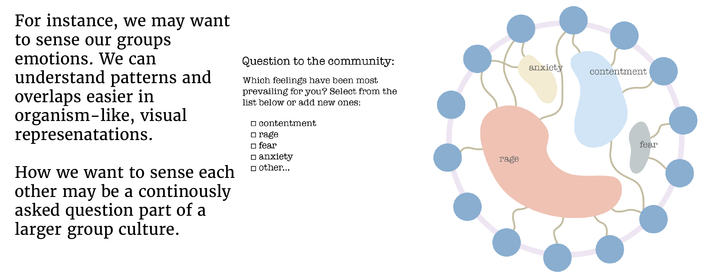

# Building a practice and visual space for trans-disciplinary cooperation

For the last two years, I have been on a quest to understand what forms of communication my community of local and international change makers requires (see my [master's thesis](https://www.omprakash.org/blog/leon-capstone-blog-week-14-overview)).  

Many friends of mine have voiced the need to sense each other better (to let emerge action), not just for complex climate change projects but for understanding who wants to live on a farm in the next 10 years. 

Here, we might think about digital tools right away. However, I am very cautious of building tools before we understand what we truly need. During many interviews, research, and my training in human-centered design (or approaches such as *designing with country*), one notion will always come up again: **what is the practice we need on a collective level?**

First I want to make the point that building a community practice is far more important than building a digital tool. 

A digital tool might help to keep the flow of nutrients going. Tools can also help to ease understanding of a landscape. 

>I see great power in visuals because complex processes can simply not be expressed within linear feeds!

But at the core of all of this lies the following:

Through organizing my network of scientists and activists across disciplines, I have learned that every group wants to engage in vastly different ways (the never ending question: should we use discord or Whatsapp?). Below is a main design co-creation for my master's study. This design fully arose out of conversations:

On a conceptual level, I want to emphasize that our interfaces are like boxes for information. This is why we need to pay close attention to the shape of the structures, into which we press information. Below is a design construct that I developed to share project work with people to continue *movement building* within the project's field. Why is this important? Well, we don't care about sharing a project to brag. **We want to share so others can jump on the train**. But to do that, we need to share about particular parts of the project. The information container below needs more work but is based on the  [movement building media principles](MEDIA-MOVEMENT-BUILDING-A.md) , which have proven to be very effective in developing the design concept below. I hope it makes sense! 

### This work arose during my capstone project, which is summarized below:

