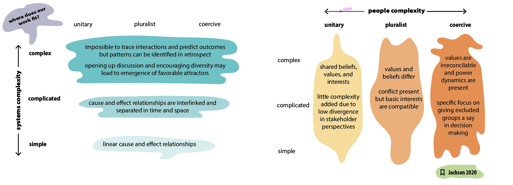

What visual spaces do we need to stay connected as a city?

add

- wind turbine pros and cons
- interface for movement-oriented project sharing: this container helps us to share projects in a way that allows recipients to continue the depicted work instead of merely reading about its glory. 
- autopoesis tree 
- eckhard tolle visuals 
- obviously images of interface designs (and odi's mockups from presentation)
- wind turbine graphics at olin and in the forest

# Creating Marbles during my Master's Program
## visualizing entangled phenomena with metaphors - informed by *complex systems thinking*

### whose project work is around us? 

### capstone project: visual metaphors for cooperation among trans-disciplinary climate justice organizers

### interface design for collaborative systems thinking: building systemic intelligence

### a synthesis of heady intellectual blocks

## Underlying principles  that shape my visualizations
The visual structure should resemble the desired form of communication. Therefore, **graphic interfaces need to consider the underlying purpose of communication** to condition the behavior of the user. 

Consider typical Zoom interfaces! They do not resemble anything. 
![][MESH-CAP_summary-graphics-HIGH-RES-04.png]

For instance, we may visually represent 
![][MESH-CAP_summary-graphics-HIGH-RES-02.png]

## contemplating how offers and needs are shared among people, using plants as mataphors

add visualization of nature/ consciousness touching itself (eckhart tolle visual)
## unconventionally streamlined interfaces using low-tech (static but responsive)

[bodywork.whitneyx.info](https://bodywork.whitneyx.info/)

### backend and frontend work

## scientific graphics

## Scattered visual work

