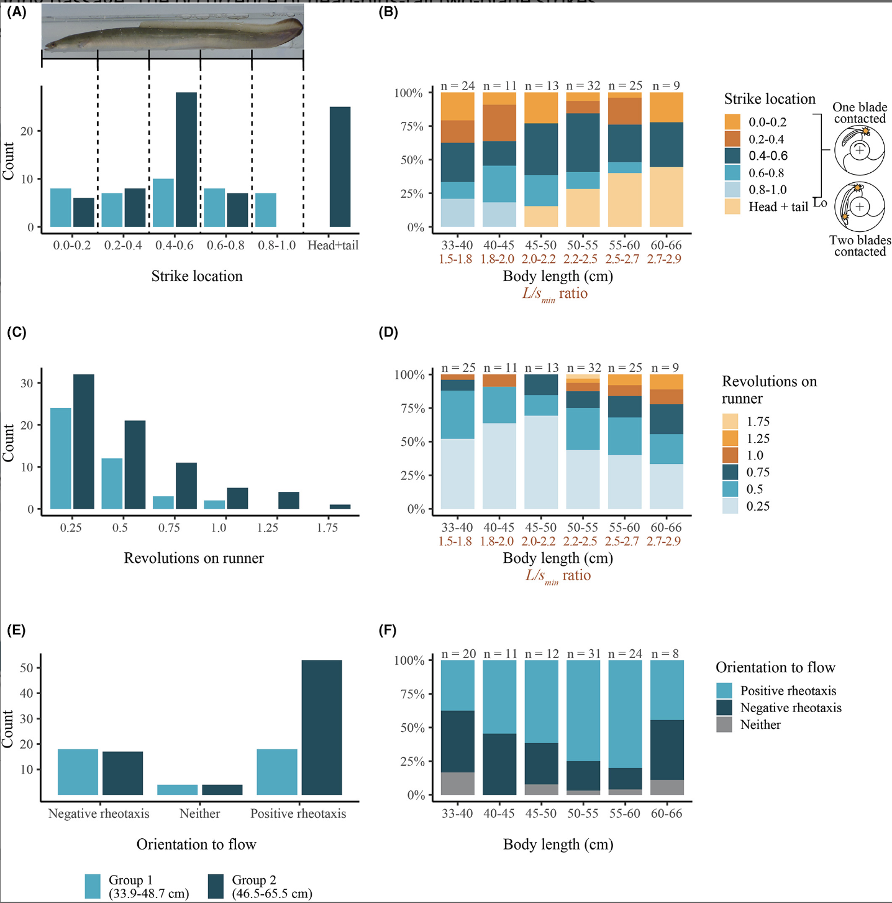
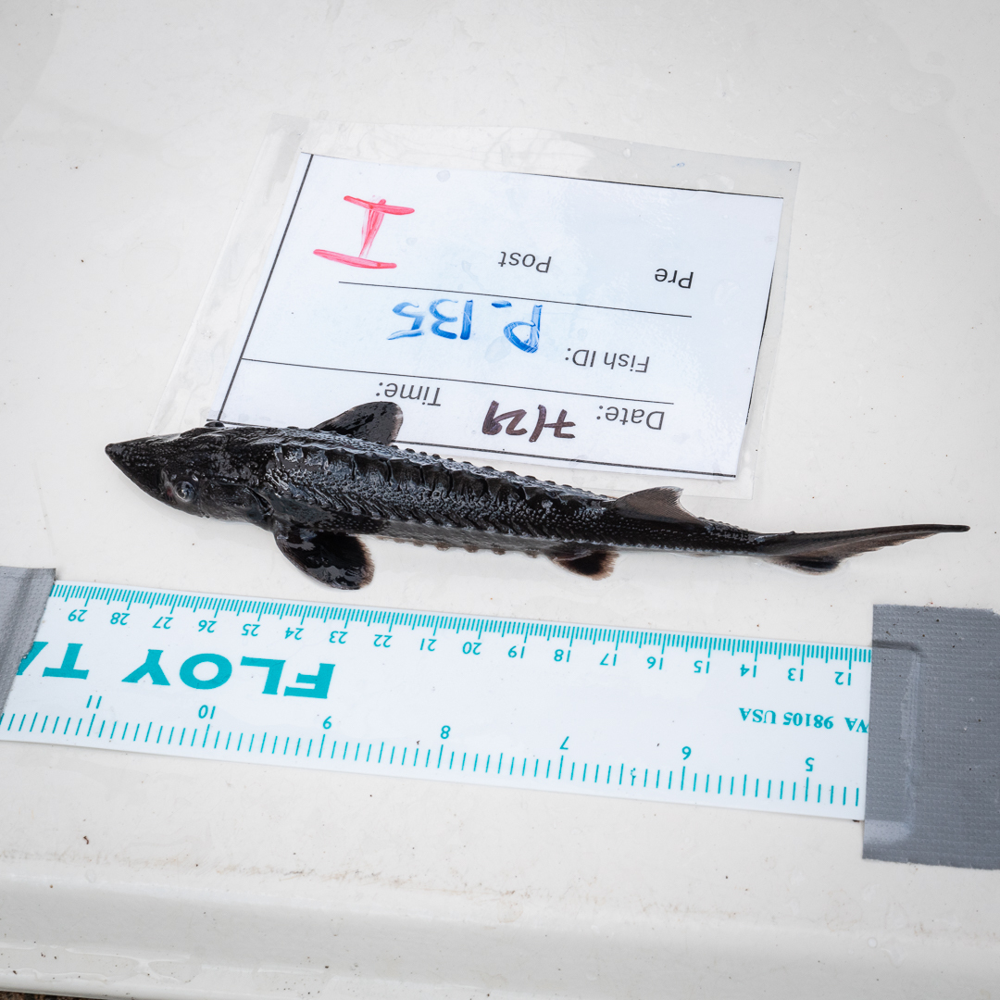
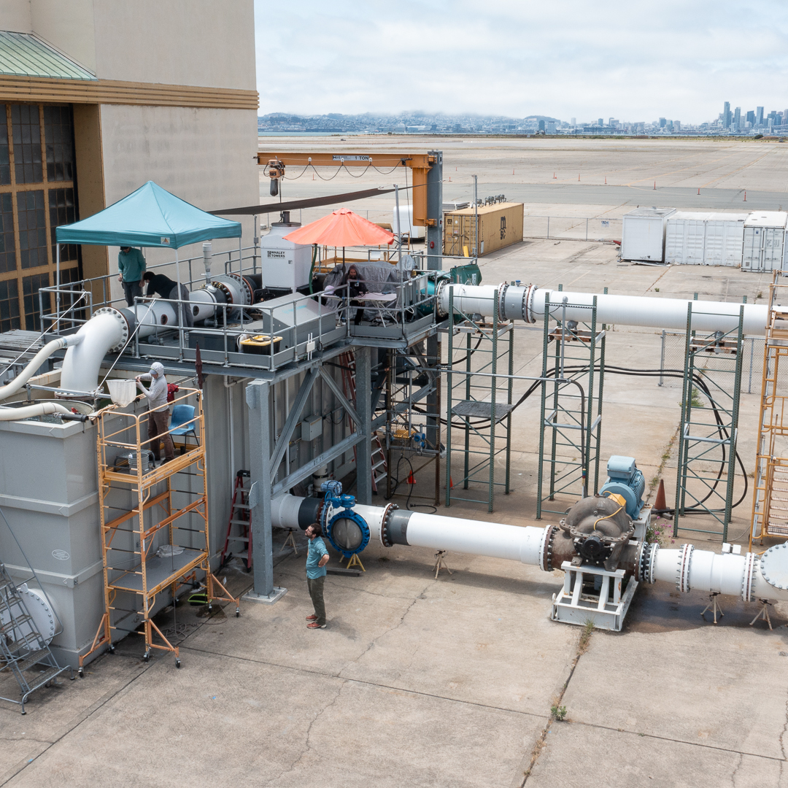
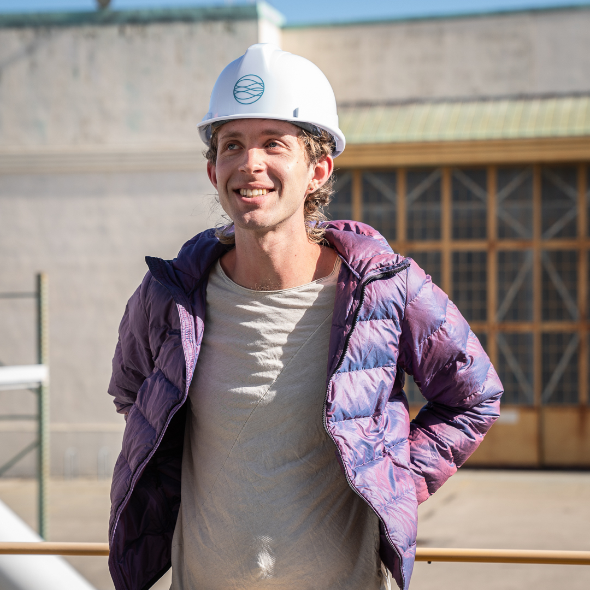

# My environmental science work with Natel Energy
<i class="fas fa-calendar-alt"></i>   *July 2021 - May 2022 + July - August 2024*

Beyond my role as a mechanical engineer, I was responsible for the data capturing and analysis of high-speed videos, behavioral swim videos, and physical metrics for a study that investigated the effects of passage through [Natel Energy](https://www.natelenergy.com/turbines)'s turbine on eels. I also created all visuals for the [paper](https://afspubs.onlinelibrary.wiley.com/doi/full/10.1002/tafs.10385), which established Natel as the first fish-safe turbine manufacturer (paper [here](https://afspubs.onlinelibrary.wiley.com/doi/full/10.1002/tafs.10385)).

Investigating the effect of turbines on fish is extremely important because almost all turbines on this planet are very deadly for passing fish (not all fish pass through them, but it is impossible to screen fish properly). In the case of endangered American eel, conventional turbines (Francis and propellor turbines) kill 10-50% of all eels that pass through them [1,2]. Eels need to migrate to the ocean to reproduce and often need to pass several turbine damns in a row.

My data analysis and capturing for our 2022 study with eels passing through Natel's turbine showed an amazing survival rate of 100% [2]. Such results were unprecedented and show how far ecologically conscious engineering practices can go. This study was peer-reviewed and consulted by the Pacific Northwest National Laboratory. It's hard to believe, but I watched all videos myself, I know it's true!

### This is me setting up the two high-speed video cameras (the runner housing is transparent so one can see the fish swimming through)

### This is a detailed graphic depicting where the eels were hit by the turbine's runner 

### Another graphic I created

### This is me netting the fish after passage through the turbine

### A photo from a study with sturgeon that I consulted in 2024

### This is the testing facility (it is very unconventional for turbine designers to investigate their impact on fish with this amount of rigor)

### Thanks for your interest, have a nice day!

_________

#### References
[1] - Heisey, P. G., Mathur, D., Phipps, J. L., Avalos, J. C., Hoffman, C. E., Adams, S. W., & De‐Oliveira, E. (2019). Passage survival of European and American eels at Francis and propeller turbines. Journal of fish biology, 95(5), 1172-1183.

[2] - Watson, S., Schneider, A., Santen, L., Deters, K. A., Mueller, R., Pflugrath, B., ... & Deng, Z. D. (2022). Safe passage of American Eels through a novel hydropower turbine. _Transactions of the American Fisheries Society_, _151_(6), 711-724. https://afspubs.onlinelibrary.wiley.com/doi/full/10.1002/tafs.10385

