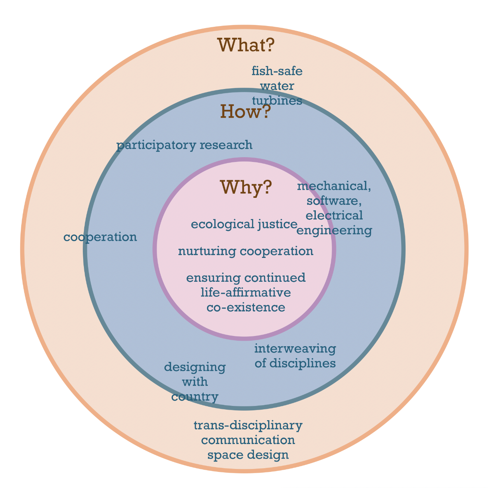

# My value system 
I share this personal value system with you because I hope to elicit a conversation with you,  rooted in alignments or a tension that we can explore together. On a deeper (intellectual) note, I take the perspective that values condition our actions. One could consider them the code or DNA of our actions that build large scale structures. I see that our values continue to live on in the projects we create (see more on this intellectual tangent under [[ONTOLOGICAL-PRIMITIVES]]). Let's jump right in. 

My baseline values include:
- **Systemic adaptation & change**
- Intentional communication
- **Cooperation**
- **Care**
- **Health**
- Consent
- Spiritual transformation
- Embodied creativity

### A few paradigms or core concepts that shape the way I see the world
1. **Holism**: We are whole to begin with. We have everything to thrive right now. 
2. **Adaptive solutions over technical solutions**: Climate change arose from very particular social systems (and value systems). Therefore, we cannot fix climate change with technology by itself. Technology is a tool. It can be helpful. But the change that is needed to reduce climate injustices needs to happen on a social level. As an engineer, I still desire to build tools to ease this process. But awareness of interwoven social-ecological dynamics is key here! 
3. **Arriving at truth requires more than the scientific method**: This might trigger you. I have understanding. Yet, the scientific method in its very nature disregards values. None of the values from the list above matter to the scientific method. It only concerns numerical truth (look at this timeline I made to demonstrate which ideas shaped the scientific method [[MMSHistOfSci-A]]). However, it is very relevant to our existence on this planet that we make conscious decisions about where to put our energy. Other approaches such as *emancipatory action research* or *designing with country* are useful frameworks to arrive at action rooted in truths held by our collective wisdom.

### Quotes that resonate and drive my work
 >*"the cause of the crisis is in the injustice"* so we need to *transform relationships of power* 
 >
 >~ Gopal Dayaneni @ Pachamama Conference 2023
 
(see more under [[CLIMATE-CHANGE-A]])

### When I work with other people, these values come to mind
<iframe style="border: 1px solid rgba(0, 0, 0, 0.1);" width="800" height="450" src="https://www.figma.com/embed?embed_host=share&url=https%3A%2F%2Fwww.figma.com%2Ffile%2FmD5UJsqvpUOGTyDATTcw2t%2Fweb-of-co-op-values%3Ftype%3Dwhiteboard%26t%3DfQMa0L0wEBQESzKN-1" allowfullscreen></iframe>
Also see note [[COOP-PRINCIPLES]].

### My movement from why to how to what
This frameworks is inspired by [Simon Sinek's](https://youtu.be/qp0HIF3SfI4?si=WnfNJJMAL4t8W6Sk) video. He argues that communicating our why before we community our how and what helps others to build movement with us. 
