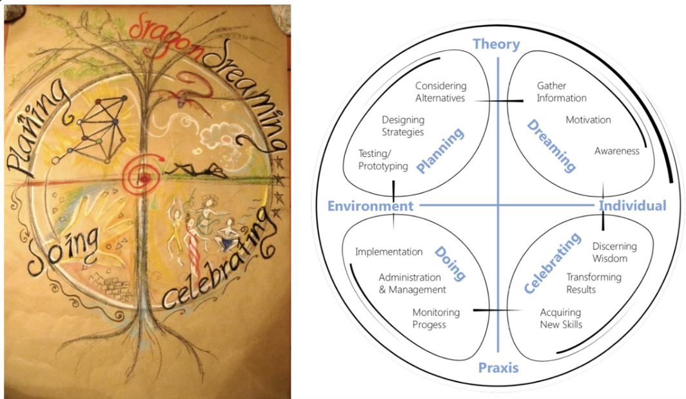

# The dragon dreaming framework
## Planning, dreaming, celebrating, doing...
I learned about this framework in September 2024, and I like it because it offers a compass-like map for our vast lives. It helps me to reflect on my life. Where do I spend most of my energy? It offers answers to why I feel discomfort with certain disciplines that largely live in the planning corner, fully-disconnected from other places. 

https://dragondreaming.org/

This framework reminds me of  [Monica Dennis’ framework](OPP-LIB-PRAC-A.md) which teaches us to move from oppressive systems to liberatory systems by reconnecting to source, story, body, and emotions. 