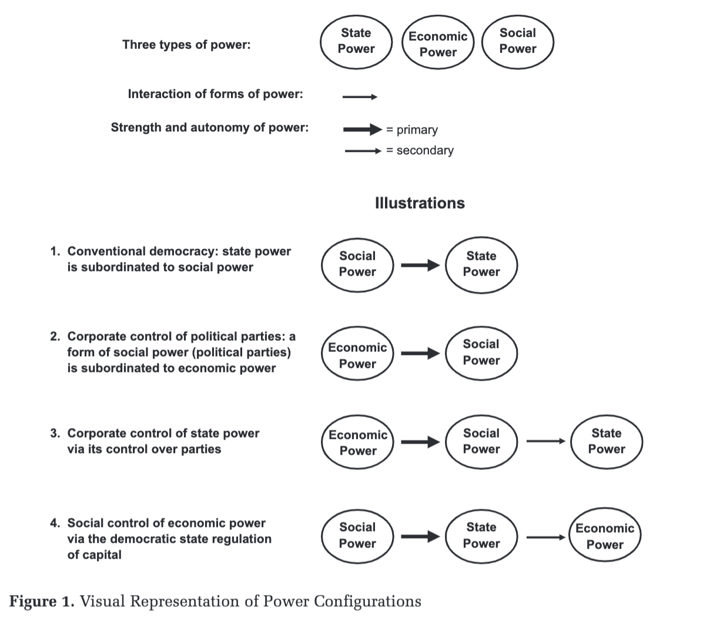
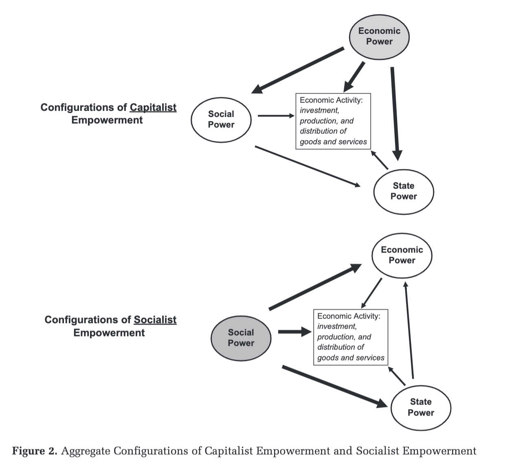

# The flow of power in different economic systems

Wright, E. O. (2013). Transforming Capitalism through Real Utopias. American Sociological Review, 78(1), 1–25. https://doi.org/10.1177/0003122412468882