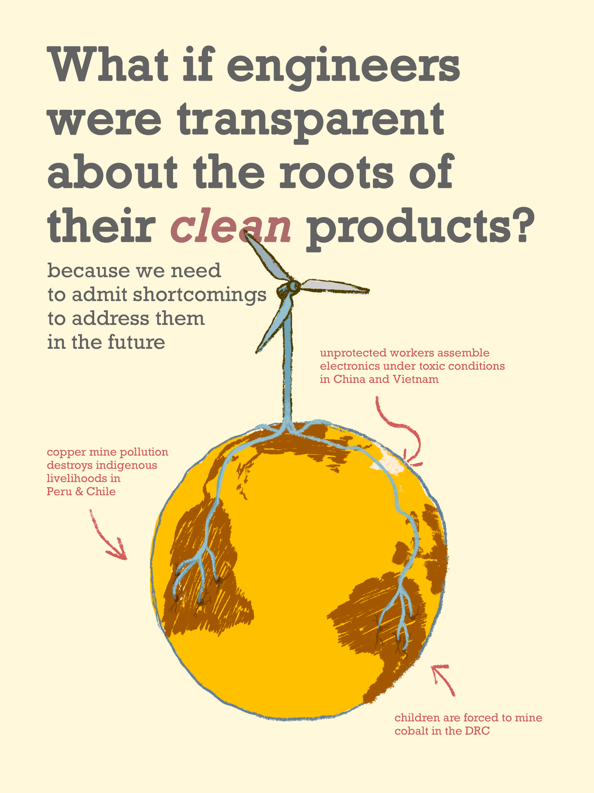
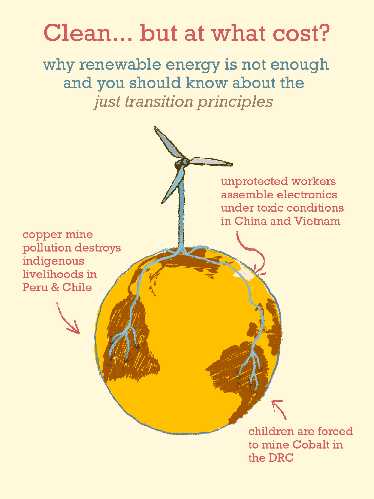
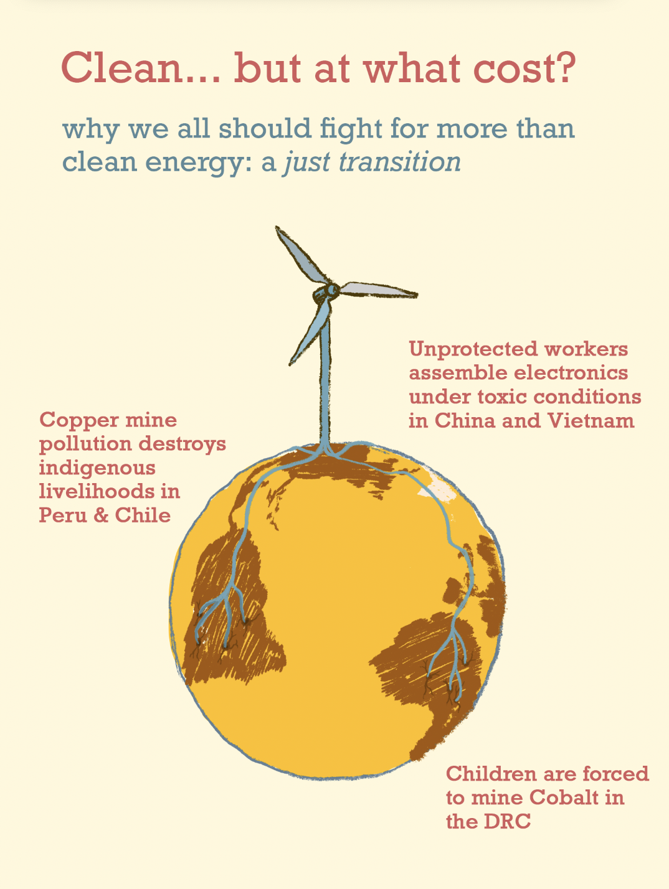
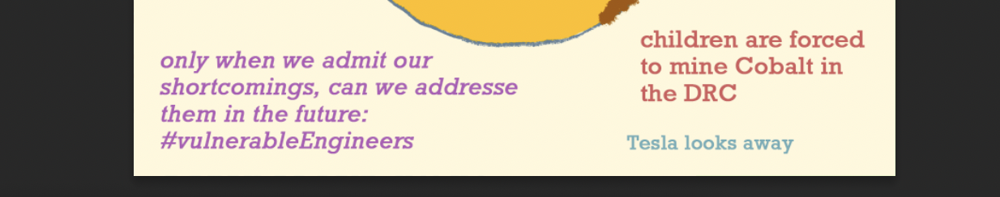

# Visualizing the roots of renewables
I drew this illustration because I can't stop thinking about this topic. I am on a journey to redefine what it means to be a good engineer. As part of this, I want to understand how we can visualize the systemic impact of *innovative* technologies.  Do you have ideas or want to chat? Please reach out. 

>Engineers design for structural integrity. But why does this not not include social integrity? How can something be considered structurally safe if the structures it requires harm human and non-human life on many dimensions but the most immediate physical one? 

**You can find a variety of resources related to this topic below the following illustration.** 

## Why roots? 
The word *radical* inherits its meaning from latin, meaning *rooted*. I drew roots because environmental injustice didn't start with CO2 in the atmosphere. Much more likely it started with a state of mind that justified the destruction of ecosystems, displacement of people, and exploitation child labor for the sake of technological & scientific development. This way of [doing things around here](TECHNOLOGY-DEFINITION-A.md) has finally led to the warming of the whole planet.

Radicalness means to find a solution to a problem by going back to the roots of the injustice (see more on [radicalness](RADICALNESS.md)). Plants have roots. The roots of plants are some of the most intelligent parts of their systems as they investigate and make decisions separately yet connected to others. Therefore, I argue that **being a radical engineer also means to a critical thinker**. Obviously and sadly, *critical theory* is a term barely stated as a core piece of a good engineer. 

## What are the *Just Transition Principles*?
The [Just Transition Principles](JUST-TRANSITION-PRINC-FRAME.md) are guidelines that help us to stay focused on addressing the root causes of environmental injustice as opposed to building technological quick fixes that perpetrate ecological destruction and human suffering. 

### The principles are:

- **Living well without harming others**
- **Meaningful Work**
- **Self-Determination**
- **Equitable Redistribution of Resources and Power**
- **Regenerative Ecological Economics**
- **Culture and Tradition**
- **Solidarity**
- **Let’s Let’s Build What We Need Right Right Now**

See their visual framework and read in more depth about them [over here](JUST-TRANSITION-PRINC-FRAME.md).

## The mining needed to sustain green technology
Wind energy and solar require **7-18 times more minerals** per energy produced compared with fossil-fuel based equivalents. Obviously, fossil fuel also needs to be extracted from this planet. But the point is that if we want to keep electricity consumption the same, we will need to dig up the whole planet for minerals. But the point is that if we want to keep electricity consumption the same, we will need to dig up the whole planet for minerals ([source here](ENERGY-ENG-A.md)). Let’s not forget that the plan is to continue to increase electricity consumption across western nations and beyond. . Let’s not forget that the plan is to continue to increase electricity consumption across western nations and beyond. 

Humanity is facing [the largest increase of mining in human history](ENERGY-ENG-A.md). 

We will need 2x more copper than we have mined throughout all human history to feed the Western green transition plans.

### Here is a quite personal interview with some humans affected by multinational mining corporations

<iframe width="560" height="315" src="https://www.youtube.com/embed/ipOeH7GW0M8?si=IiPE9EmO_6vmld0Z" title="YouTube video player" frameborder="0" allow="accelerometer; autoplay; clipboard-write; encrypted-media; gyroscope; picture-in-picture; web-share" referrerpolicy="strict-origin-when-cross-origin" allowfullscreen></iframe>

<iframe src="https://player.vimeo.com/video/122399156?badge=0&amp;autopause=0&amp;player_id=0&amp;app_id=58479" frameborder="0" allow="autoplay; fullscreen; picture-in-picture; clipboard-write" style="position:absolute;top:0;left:0;width:100%;height:100%;" title="Maxima Acuña de Chaupe"></iframe>

## Reading more

Science or the People: Bleeding Earth, [Volume 25, no. 2](https://magazine.scienceforthepeople.org/volume-25-number-2-bleeding-earth/)
[The history of copper mining in Chile](https://magazine.scienceforthepeople.org/vol25-2-bleeding-earth/the-minerals-must-flow/) 

%%
## On the other hand, far more mining is required for fossil fuels 

%%

%%
- mining is harmful to the world
- our current clean plans require massive increase in resource mining 

MINING VIDEOS:
https://youtu.be/_V3bIzNX4co?si=lyabGzTwzKuVqNkY
https://powerlands.org/

What if we focused on reduction of harm? What if engineers 

The  energy transition is already underway. Science is inherently political. What do we value in the process of innovation? What do we ignore? 

Green energy here but at what cost in the global south?

What if engineers were transparent/honest about the roots of their "clean" products?
Subtitle: only when we admit shortcomings, can we address them in the future. 
conclusion: we don't need to be perfect right now but we need to be vulnerable enough to grow.

add in the middle: radical engineering means to go back to the roots of the injustice

What if engineers were transparent/honest about the roots of their "clean" products?
Subtitle: only when we admit shortcomings, can we address them in the future. 

## Evolution from an earlier illustration 

## other title ideas for the first illustration
- what would it mean to be a radical engineer?
- \
- Radical engineers would therefore share transparently about areas of their work that contribute to injustices. 
- 
## more options 

I am currently unsure what narrative works best. Some narratives are below. The draft image is another potential narrative:
- Clean energy in the US, extraction and pollution somewhere else. 
- **What if engineers drew the resource roots of wind energy and labeled them honestly?** 
- Imagine every product came with a 3D animation of all its resource roots and respective working conditions and environmental impact 

### potential clear two categories for message:

extraction there, growth somewhere else. 
extraction creates refugees and pollutes ecosystems 

growth of wind turbine plant seems wonderful. 

the current state of green technology can’t be the final solution. so we (engineers) need to vulnerably communicate our shortcomings.
## about the roots
[[RADICALNESS]] means to go back to the roots of the injustice. It could make sense to focus the message on "going back to the roots of the injustice and paying attention wherever engineering practices contribute to injustice"

### insights or quotes that arose during this creative process 
> Engineers love structural integrity. But there is no structural integrity if it’s physically stable but socially destructive. (is there a better word that describes physical destructive instability?)

>we need to change the narrative from "how much harm is okay?" to "how can we reduce the harm?" ( from imagening climate futures seminar)

## questions on my mind (aka question-quotes)
When will engineers transparently admit their shortcomings with the same rigor they design their technology?

When will engineers transparently design for eco-social stability with the same rigor they design for structural integrity?

## links to share in final post 
- an example of community-oriented mining 
- studies that show mining pollution 
- how african countries are interely owned by other coutnries due to mining etc (i think on insta?)
- 🌟 caroline’s mining paper
- [JUST-TRANSITION-PRINCIPLES](JUST-TRANSITION-PRINC-FRAME.md)
- [RADICALNESS](RADICALNESS.md)

## Old versions

V4

V3

V2

V1

## contemplating the ending punch

our current engineers systems will hurt this planet. 
the largest 

%%