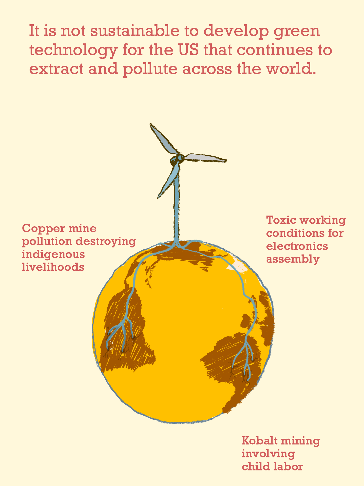

# Visualizing the roots of renewables
## Resources related to the illustration
I drew this illustration because I can't stop thinking about this topic. I am on a journey to redefine what it means to be a good engineer. As part of this, I want to understand how we can visualize the systemic impact of *innovative* technologies. 

>Engineers design for structural integrity. But why does this not include social integrity? How can something be considered structurally safe if the structures it requires harm human and other-than-human life on many dimensions? 

## What are the *Just Transition Principles*?
The [Just Transition Principles](JUST-TRANSITION-PRINC-FRAME.md) are guidelines that help us to stay focused on addressing the root causes of environmental injustice as opposed to building technological quick fixes that perpetrate ecological destruction and human suffering. 

### The principles are:

- **Living well without harming others**
- **Meaningful Work**
- **Self-Determination**
- **Equitable Redistribution of Resources and Power**
- **Regenerative Ecological Economics**
- **Culture and Tradition**
- **Solidarity**
- **Let’s Let’s Build What We Need Right Right Now**

*The Just Transition Framework: moving from an extractive economy to a regenerative economy*

## Why roots? 
The word *radical* inherits its meaning from latin, meaning *rooted*. I drew roots because environmental injustice didn't start with CO2 in the atmosphere. Much more likely, it started with a state of mind that justified the destruction of ecosystems, displacement of people, and child labor for the sake of technological & scientific development. This way of [doing things around here](TECHNOLOGY-DEFINITION-A.md) has finally led to the warming of the whole planet.

To me, radicalness means to find a solution to a problem by going back to the roots of the injustice (see more on [radicalness](RADICALNESS.md)). In an engineering context, much of the injustice occurs via the supply chains, somewhere far away from the deployment of clean energy products. 

Plants have roots. The roots of plants are some of the most intelligent parts of their systems as they investigate and make decisions separately yet connected to the larger organism. Therefore, I argue that **being a radical engineer also means to a critical thinker**. Obviously and sadly, *critical theory* is a term barely stated as a core piece of a good engineer. 

## The mining needed to sustain green technology
Wind energy and solar require **7-18 times more minerals** per energy produced compared with fossil-fuel based equivalents (per unit of energy produced). To put the energy transition effort into context, the below quotes might help. 

>We will need 2x more copper than we have mined throughout all human history to feed the Western green transition plans. (looking for source)

>To convert our current energy systems as planned by Western governments, we would face the largest increase of production of metals in human history.
>
~ [Mark Mills](ENERGY-ENG-A.md)

### We need to analyze with nuance!
Obviously, fossil fuels also need to be extracted from this planet (and such mining doesn't fall under the category of "mineral" mining as mentioned above). If we compare total mining operations, some voices state that:

> A fossil fuel economy requires 535x more mining than a clean energy economy. 
> 
> ~ Michael Thomas, [Article in Distilled](https://www.distilled.earth/p/a-fossil-fuel-economy-requires-535x)

The problem will always stay the same. Mining is an inherently extractive process which has to harm our mother earth and the beings that depend on the land where mining takes place. Since there is so much inherent harm to land and people involved, we have to move very consciously and center the needs of the most affected groups and ecosystems. 

Some mining projects try to involve communities at varying rates of success. It is extremely hard to find success stories in this complicated field. If you want to learn more about the efforts to pursue socially just mining, please refer to the research paper by Baillie et. al below. 

### Here is a quite personal interview with some humans affected by multinational mining corporations

<iframe src="https://player.vimeo.com/video/122399156?badge=0&amp;autopause=0&amp;player_id=0&amp;app_id=58479" frameborder="0" allow="autoplay; fullscreen; picture-in-picture; clipboard-write" style="position:absolute;top:0;left:0;width:100%;height:100%;" title="Maxima Acuña de Chaupe"></iframe>

_________

## Here are more works if you want to dig deeper

#### Archive
- An Archive for mining projects and their effects on communities: [Mining and Communities](https://www.minesandcommunities.org/)

#### Magazine
- Science or the People: Bleeding Earth, [Volume 25, no. 2](https://magazine.scienceforthepeople.org/volume-25-number-2-bleeding-earth/) :[The history of copper mining in Chile](https://magazine.scienceforthepeople.org/vol25-2-bleeding-earth/the-minerals-must-flow/)
#### Research Papers
- Armstrong, R., Baillie, C., & Cumming-Potvin, W. (2014). **Mining and communities: understanding the context of engineering practice**. _Synthesis Lectures on Engineers, Technology and Society_, _8_(1), 1–148. https://doi.org/10.2200/S00564ED1V01Y201401ETS021
- Baillie, C., Feinblatt, E., Alejandro, J., Rondon, G., Aitken, J., & Armstrong, R. (2020). **Intro & community engagement in peru. In Socially Just Mining: Rethoric or Reality? Lessons from Peru (Synthesis Lectures on Engineers, Technology, & Society)** (1st ed., p. 236). Springer.
- Eichhorn, S. J. (2022). **Resource extraction as a tool of racism in West Papua**. _The International Journal of Human Rights_, 1–23. https://doi.org/10.1080/13642987.2022.2036722
- Confalonieri, U. E. C., Margonari, C., & Quintão, A. F. (2014). **Environmental change and the dynamics of parasitic diseases in the Amazon**. _Acta Tropica_, _129_, 33–41. https://doi.org/10.1016/j.actatropica.2013.09.013

#### Article
- The spiralling environmental cost of our lithium battery addiction - WIRED UK. (n.d.). Retrieved October 4, 2023, from https://www.wired.co.uk/article/lithium-batteries-environment-impact

#### Movies
- [Power Lands](https://powerlands.org/)
%%
## On the other hand, far more mining is required for fossil fuels 

<iframe width="560" height="315" src="https://www.youtube.com/embed/ipOeH7GW0M8?si=IiPE9EmO_6vmld0Z" title="YouTube video player" frameborder="0" allow="accelerometer; autoplay; clipboard-write; encrypted-media; gyroscope; picture-in-picture; web-share" referrerpolicy="strict-origin-when-cross-origin" allowfullscreen></iframe>

%%

%%
- mining is harmful to the world
- our current clean plans require massive increase in resource mining 

MINING VIDEOS:
https://youtu.be/_V3bIzNX4co?si=lyabGzTwzKuVqNkY
https://powerlands.org/

What if we focused on reduction of harm? What if engineers 

The  energy transition is already underway. Science is inherently political. What do we value in the process of innovation? What do we ignore? 

Green energy here but at what cost in the global south?

What if engineers were transparent/honest about the roots of their "clean" products?
Subtitle: only when we admit shortcomings, can we address them in the future. 
conclusion: we don't need to be perfect right now but we need to be vulnerable enough to grow.

add in the middle: radical engineering means to go back to the roots of the injustice

What if engineers were transparent/honest about the roots of their "clean" products?
Subtitle: only when we admit shortcomings, can we address them in the future. 

## Evolution from an earlier illustration 

## other title ideas for the first illustration
- what would it mean to be a radical engineer?
- \
- Radical engineers would therefore share transparently about areas of their work that contribute to injustices. 
- 
## more options 

I am currently unsure what narrative works best. Some narratives are below. The draft image is another potential narrative:
- Clean energy in the US, extraction and pollution somewhere else. 
- **What if engineers drew the resource roots of wind energy and labeled them honestly?** 
- Imagine every product came with a 3D animation of all its resource roots and respective working conditions and environmental impact 

### potential clear two categories for message:

extraction there, growth somewhere else. 
extraction creates refugees and pollutes ecosystems 

growth of wind turbine plant seems wonderful. 

the current state of green technology can’t be the final solution. so we (engineers) need to vulnerably communicate our shortcomings.
## about the roots
[[RADICALNESS]] means to go back to the roots of the injustice. It could make sense to focus the message on "going back to the roots of the injustice and paying attention wherever engineering practices contribute to injustice"

### insights or quotes that arose during this creative process 
> Engineers love structural integrity. But there is no structural integrity if it’s physically stable but socially destructive. (is there a better word that describes physical destructive instability?)

>we need to change the narrative from "how much harm is okay?" to "how can we reduce the harm?" ( from imagening climate futures seminar)

## questions on my mind (aka question-quotes)
When will engineers transparently admit their shortcomings with the same rigor they design their technology?

When will engineers transparently design for eco-social stability with the same rigor they design for structural integrity?

## links to share in final post 
- an example of community-oriented mining 
- studies that show mining pollution 
- how african countries are interely owned by other coutnries due to mining etc (i think on insta?)
- 🌟 caroline’s mining paper
- [JUST-TRANSITION-PRINCIPLES](JUST-TRANSITION-PRINC-FRAME.md)
- [RADICALNESS](RADICALNESS.md)

## Old versions

V4

V3

V2

V1

## contemplating the ending punch

our current engineers systems will hurt this planet. 
the largest 

%%