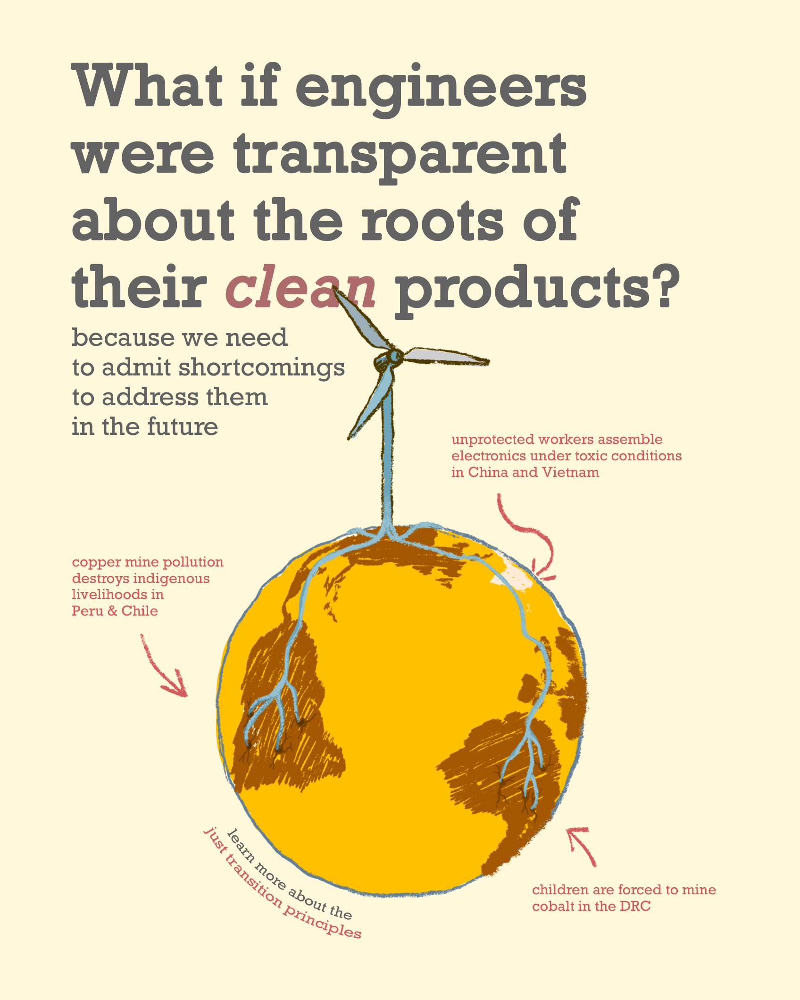

# Visualizing the roots of renewables
The word *radical* inherits its meaning from latin, meaning *rooted*. Radicalness means to go back to the roots of the injustice (see more on [radicalness](RADICALNESS.md)).

Green energy here but at what cost in the global south?

What if engineers were transparent/honest about the roots of their "clean" products?
Subtitle: only when we admit shortcomings, can we address them in the future. 
conclusion: we don't need to be perfect right now but we need to be vulnerable enough to grow.

add in the middle: radical engineering means to go back to the roots of the injustice

What if engineers were transparent/honest about the roots of their "clean" products?
Subtitle: only when we admit shortcomings, can we address them in the future. 

## inspiration evolved from this earlier illustration 

## other title ideas for the first illustration
- what would it mean to be a radical engineer?
- \
- Radical engineers would therefore share transparently about areas of their work that contribute to injustices. 
- 
## more options 

I am currently unsure what narrative works best. Some narratives are below. The draft image is another potential narrative:
- Clean energy in the US, extraction and pollution somewhere else. 
- **What if engineers drew the resource roots of wind energy and labeled them honestly?** 
- Imagine every product came with a 3D animation of all its resource roots and respective working conditions and environmental impact 

### potential clear two categories for message:

extraction there, growth somewhere else. 
extraction creates refugees and pollutes ecosystems 

growth of wind turbine plant seems wonderful. 

the current state of green technology can’t be the final solution. so we (engineers) need to vulnerably communicate our shortcomings.
## about the roots
[[RADICALNESS]] means to go back to the roots of the injustice. It could make sense to focus the message on "going back to the roots of the injustice and paying attention wherever engineering practices contribute to injustice"

This is a metaphorical depiction, which I use across my illustration (see [METAPHORICAL-RELATIONSHIPS-OF-ORGS](METAPHORICAL-RELATIONSHIPS-OF-ORGS.md)).

### insights or quotes that arose during this creative process 
> Engineers love structural integrity. But there is no structural integrity if it’s physically stable but socially destructive. (is there a better word that describes physical destructive instability?)

>we need to change the narrative from "how much harm is okay?" to "how can we reduce the harm?" ( from imagening climate futures seminar)

## questions on my mind (aka question-quotes)
When will engineers transparently admit their shortcomings with the same rigor they design their technology?

When will engineers transparently design for eco-social stability with the same rigor they design for structural integrity?

## links to share in final post 
- an example of community-oriented mining 
- studies that show mining pollution 
- how african countries are interely owned by other coutnries due to mining etc (i think on insta?)
- caroline’s mining 
- [JUST-TRANSITION-PRINCIPLES](JUST-TRANSITION-PRINC.md)
- [RADICALNESS](RADICALNESS.md)

## The social effects of mining

<iframe src="https://player.vimeo.com/video/122399156?badge=0&amp;autopause=0&amp;player_id=0&amp;app_id=58479" frameborder="0" allow="autoplay; fullscreen; picture-in-picture; clipboard-write" style="position:absolute;top:0;left:0;width:100%;height:100%;" title="Maxima Acuña de Chaupe"></iframe>

## Old versions

V4

V3

V2

V1

## contemplating the ending punch

our current engineers systems will hurt this planet. 
the largest 