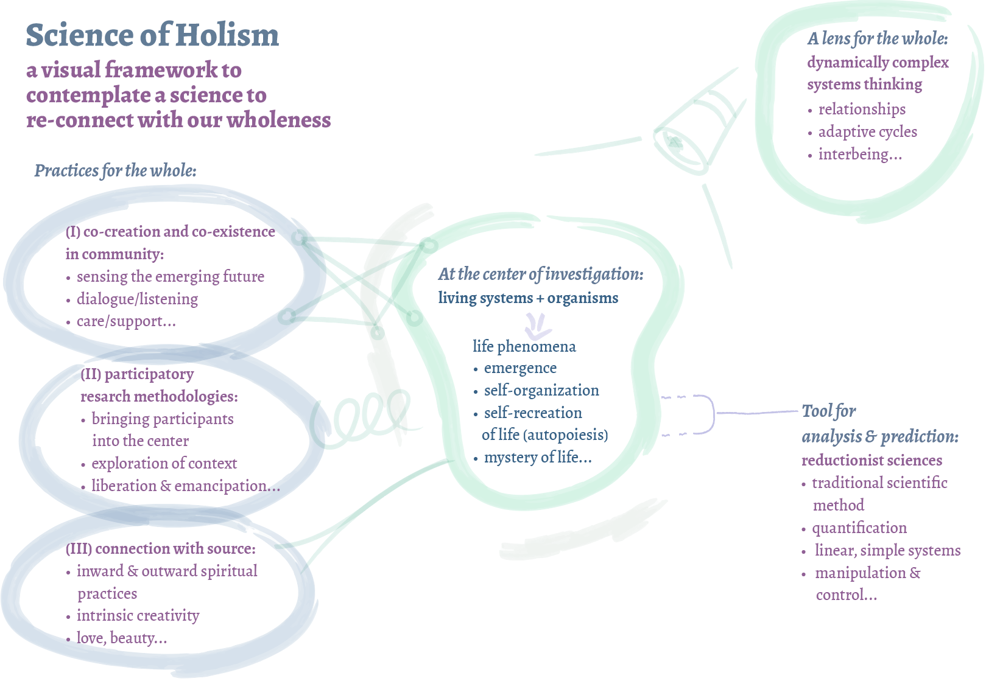

# An attempt to frame my science of holism
## Bringing together a lens, methodologies, and practices

I developed this framework quite some time ago in 2021 for my Bachelor's thesis called [Holistic engineering and a renewed science of holism for a thriving world](THESIS-HOLISTIC-ENGINEERING.md). It was my attempt to bring together the essential pieces of my research: 

1. complex systems thinking as a lens for the whole
2. at the center is life
3. practices for life 
4. how reductionist science has its small part in it 

## Related marbles
- The reductionist tendencies of the scientific method are explored in my marble that visualizes the epistemological pieces that influenced the scientific method: [MMSHistOfSci-A](MMSHistOfSci-A.md)
- My ever-growing collection of holistic frameworks: [HOLISTIC-FRAMEWORKS](HOLISTIC-FRAMEWORKS.md)
- [Philosophy of Science](MMSPhilOfSciA.md) - taking a critical stance toward the traditional scientific method

%%

Practices for the whole:
- eating, food, daily rhtyms (Ayurveda)
- being in our bodies (Yoga)
- creative practice
- doing research together
- being in community together

%%
## The old hand-drawn framework
I wonder if I like this hand-drawn framework more than the upper illustration. 
