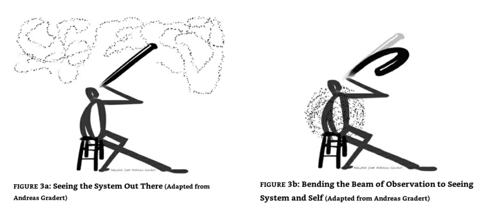

# Otto Scharmer's framework for turning inward to see the external system within ourselves

__________

Scharmer, Otto; Kaufer, Katrin. Leading from the Emerging Future: From Ego-System to Eco-System Economies (p. 187-189). Berrett-Koehler Publishers. Kindle Edition. 

