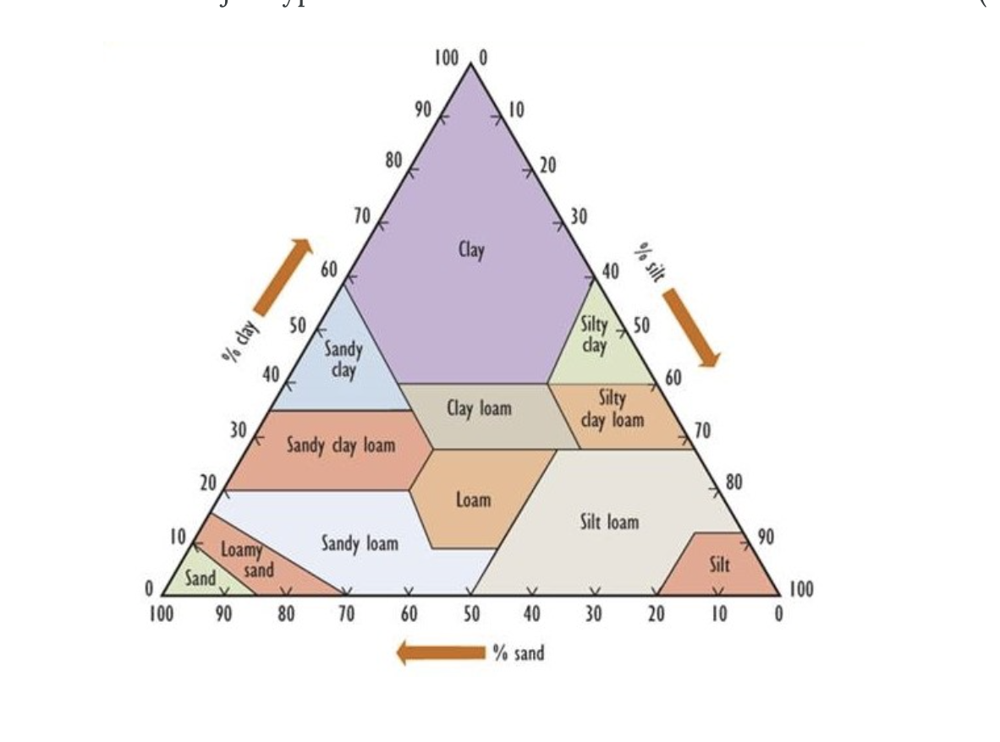

# A Textural Classification of Soils

The percentage composition of clay-, silt-, and sand-sized particles is used to classify soils into the 12 major types that are shown

https://ecampusontario.pressbooks.pub/environmentalscience/chapter/chapter-5-flows-and-cycles-of-nutrients/