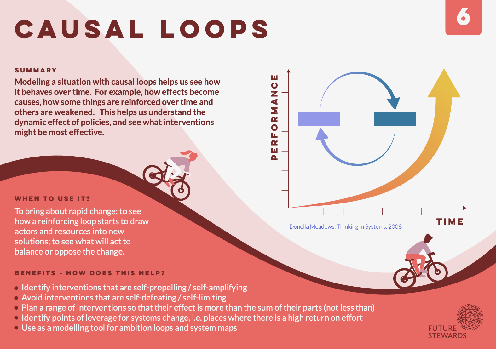
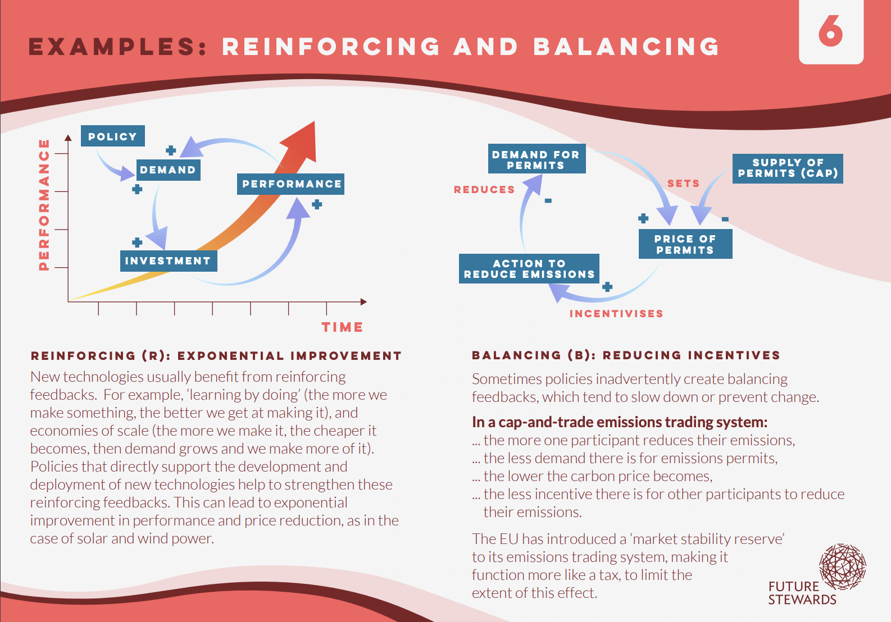

# Resources for understanding the tool "causal loops"

### Systems Futures Material [1]

_______

[1] - Arsene Ngombe - https://systems-futures.mn.co/sign_in?from=https%3A%2F%2Fsystems-futures.mn.co%2Fposts%2F71307121%3Fnotification_id%3D5415439066%26origin_method%3Demail

