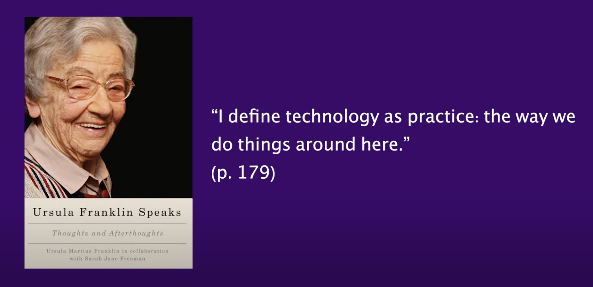

# How do we define technology?
## A broader way of looking at it...

This quote reminds me that technology does not need to be limited to the creation of machines. Technology can be understood as an intentional process. Especially for engineers, this perspective surfaces the need to consider solutions that are more diverse than the creation of mechanical or digital tools. 

Technology may incorporate research methodologies and practices. Whom do we listen to when we create? From what place do we create? Why do we create? All of these questions reflect on the "way we do things around here."

___________
### References 
- Franklin, U. M., & Freeman, S. J. (2014). _Ursula Franklin Speaks: Thoughts and Afterthoughts_ (1st ed., p. 272). Montreal & Kingston: McGill-Queen’s University Press.