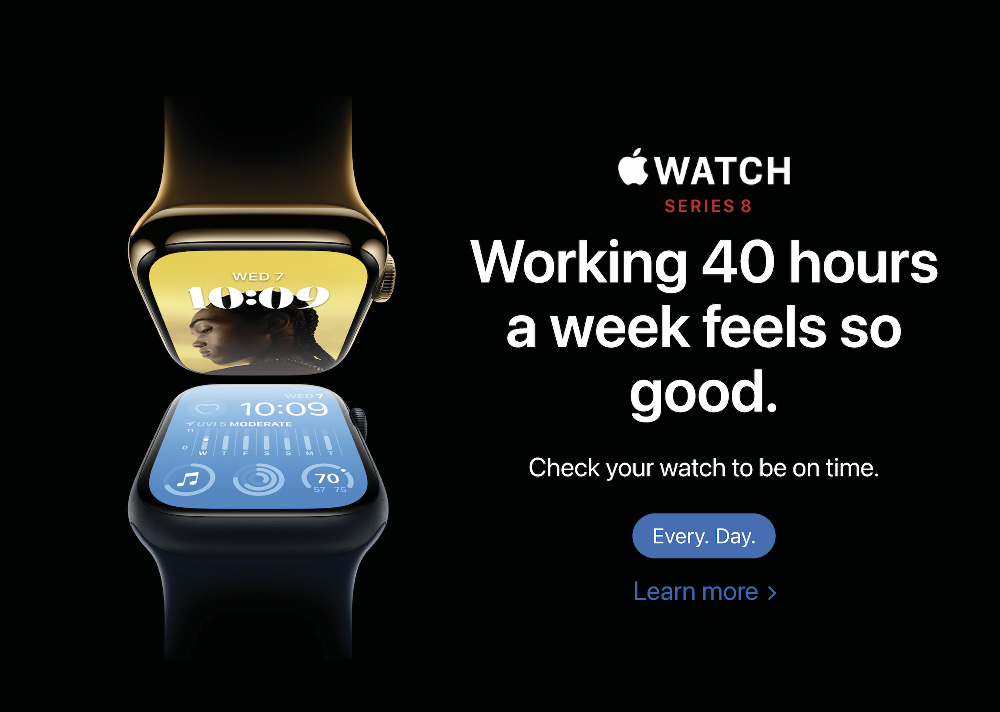
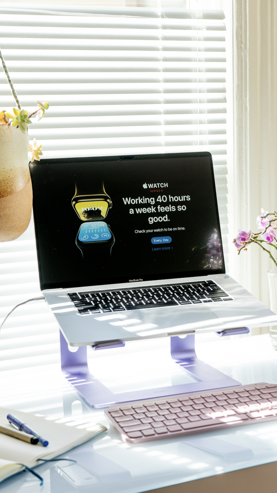

# Working 40 hours a week feels so good.
## An art piece exploring our work ethic with tech giants
This piece exploits the super easy in-browser editing of websites to interject a statement. Anyone can do it. 

### Some info on the Apple Watch

>The latest Apple Watch [...] is synchronised to within 50 milliseconds of Apple’s own super accurate time servers.
>
> ~ Tom Evans in the Book "Managing Time Mindfully"

### Related marbles
I created another piece that exploits in-browser editing of HTML text with a spin on modern-day work ethics called [[A-two-day-weekend-thats-enough-for-me-AppleTV]].

### References
[1] Evans, Tom. Managing Time Mindfully: A Mindful Approach to Time Management (Practical Mindfulness Book 1) (Function). Kindle Edition. 
### More versions below

