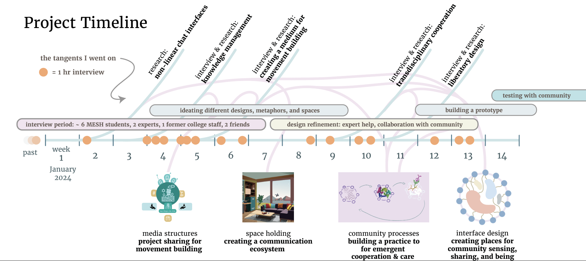

<i class="fas fa-calendar-alt"> Sept. 15th 2024</i>
# Climate justice cross-pollination for a regenerative economy
## Enabling a practice for value-creation & co-sensing

>
>Dear enablers at Rhizome,
>
>May this vertical slide show help you gain insights into our dedication, alignment with your values, past explorations, and current design concept!
>
>[Leon Santen](https://leonsanten.info/) & [Odalys Benitez](https://odalysbenitez.com/)

## At the core of our work lies *inducing an iterative community practice* 

## The previous work that led to our proposed design concept
You can find the intro to our prior work [over here](MMSSystemicCooperationInterface-A.md).

## Here is our interface mockup
We designed the pieces below with our communities. It uses the natural metaphor of bees (people) pollinating flowers (co-creations). 

### People view
**Why?** A catchy storytelling view that centers people and their embodiment of values and relationships rather than purely project work. In this view, some actions that can be taken are clicking and hovering over people (bees) to understand more clearly who they are, organizations they’re connected to, sentimental blurbs, links to other social media.

### Disciplinary view
**Why?** The community and user may gain a deeper sense of the interconnected nature of a particular community (at conferences, events, activism spaces...). In this view, some actions that can be taken are understanding relationships between different projects, and different bees. Through seeing several relationships at once, we can engage in collective sensing about the state, nourishment, and needs of various projects and people. Is there a section of the garden that is particularly lonely? Is there a bee roaming the outskirts?

## Project view
**Why?** This view is for users who like to explore a community through the lens of active work on the ground. In this view, some actions that can be taken are hovering over a flower (project) and understanding more of its conception, desires, needs, and links to other material.

## Our system flow diagram for interface sections

## Past concepts that led to this proposal

### International MESH students loved this very simple graphic to sense their community 
MESH: [Online Master of Science in Engineering, Sustainability and Health](https://onlinedegrees.sandiego.edu/masters-engineering-sustainability-health/classes/) (very radical re-matriation/de-colonial program run by Caroline Baillie)

### We helped group members understand who is doing what with visuals (outsiders and students loved this!)

### We contemplated how we need to share information so others can jump on the same activism train
Also see: [Emancipatory Media Principles](MEDIA-MOVEMENT-BUILDING-A.md)

## The metaphorical exploration of relationships 
Deeper thoughts [over here](METAPHORICAL-RELATIONSHIPS-OF-ORGS.md).

# Thank you for your time & attention! 💖
  