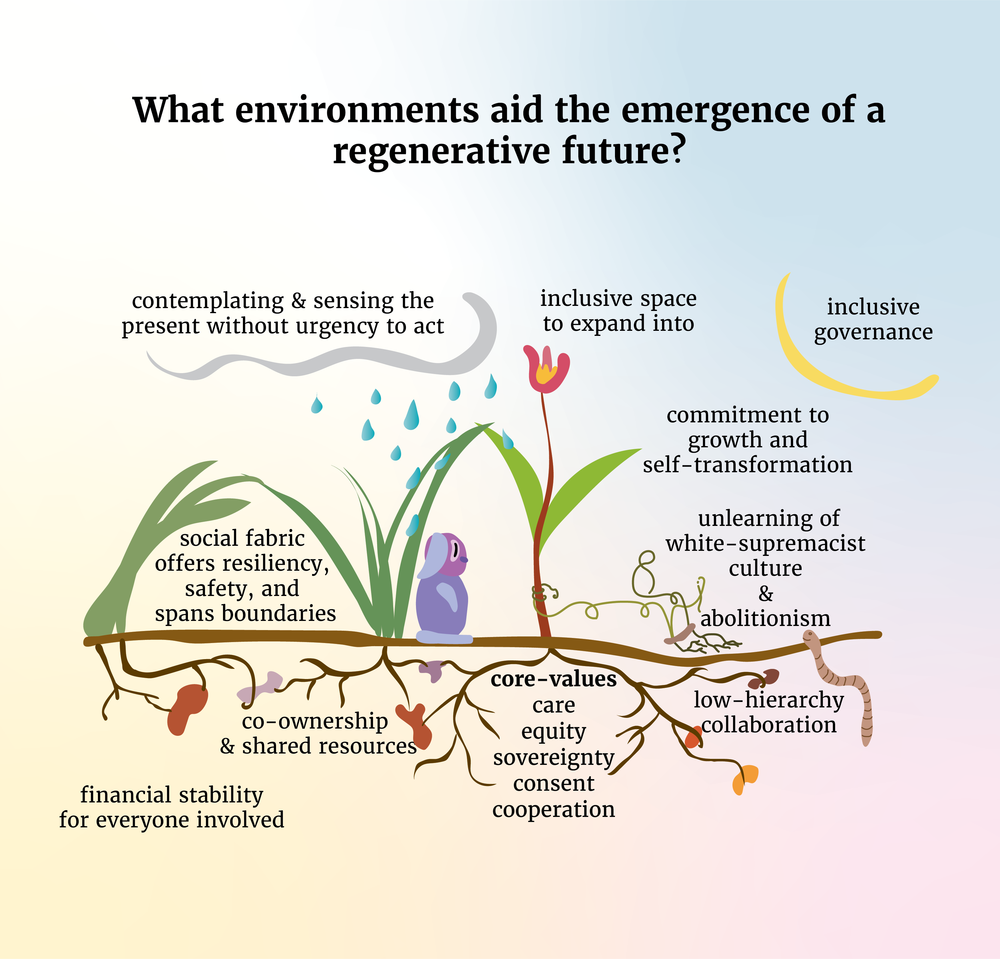
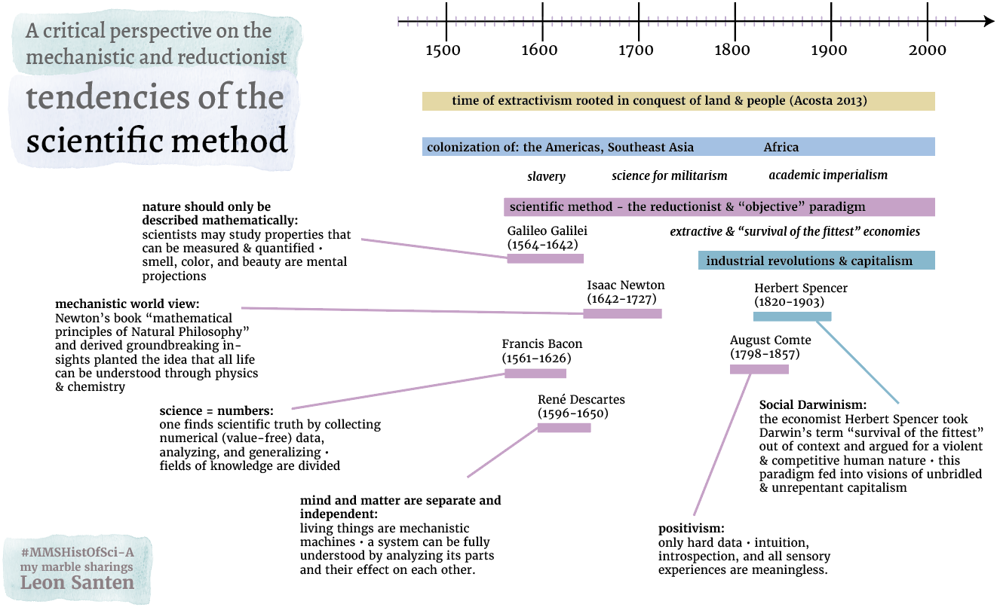

# A selection of graphics
Dear critical creators at SF Chronicle, 

I only started creating intentional graphics in 2022. It is my new passion to communicate this way. 

Let me share with you **five categories** for *visuals I create when*...

## when I visualize complex processes metaphorically...

#### …to my surprise, someone called this illustration one of the "[best systems change work theories they have seen since the inception of sustainability work](https://www.linkedin.com/feed/update/urn:li:activity:7191043760586207233/)." 

## when I critically research common narratives...

#### Here is a [blog post](https://www.omprakash.org/blog/just-energy-hub-exploration) where I critically push the boundaries of engineering. 

## when I co-design with communities to envision change...

## when I design streamlined, UX-conscious interfaces...
[bodywork.whitneyx.info](https://bodywork.whitneyx.info/)

## when I create visuals for research papers...

#### find my longer portfolio [over here](https://leonsanten.info/marbles/COLLECTION-GRAPHICS-UI/).

I am very eager to grow with you! 

Warmly, 

Leon 

